class: title-slide-custom
count: false


```{r setup, include = FALSE}
nord0 = "#2E3440"
nord1 = "#3B4252"
nord2 = "#434C5E"
nord3 = "#4C566A"

## Snow Storm colors
nord4 = "#D8DEE9"
nord5 = "#E5E9F0"
nord6 = "#ECEFF4"

## Frost colors
nord7 = "#8FBCBB"
nord8 = "#88C0D0"
nord9 = "#81A1C1"
nord10 = "#5E81AC"

## Aurora colors
nord11 = "#BF616A"
nord12 = "#D08770"
nord13 = "#EBCB8B"
nord14 = "#A3BE8C"
nord15 = "#B48EAD"


knitr::opts_chunk$set(dev = "png", dpi = 600, 
                      dev.args = list(bg = "transparent", type = "cairo",
                                      antialias = "none"),
                      out.width = "100%", fig.width = 8, fig.height = 3.5)


library("ggplot2")
theme_set(theme_gray())
theme_update(panel.grid = element_blank(),
             plot.background = element_rect(fill = "transparent",
                                            colour = "transparent"),
             panel.background = element_rect(fill = nord0),
             panel.border = element_rect(fill = 'transparent',
                                         color = nord1),
             legend.key = element_blank(),
             legend.background = element_blank(),
             legend.position = "none",
             legend.text = element_text(color = nord3),
             strip.background = element_rect(fill = nord1, colour = nord1),
             strip.text = element_text(color = nord4, face = "bold"),
             axis.text = element_text(color = nord3),
             axis.title = element_text(color = nord3)
)


library("JointAI")

library("knitr")
xaringanExtra::use_tile_view()
xaringanExtra::use_fit_screen()
xaringanExtra::use_share_again()

```


<div style="font-size: 50pt; font-weight: 900; color: var(--nord4); margin-top: 60px;">
Joint Analysis and Imputation<br>of Incomplete Data in R
</div>

<div style="font-size: 26pt; color: var(--nord9); font-weight: 300; margin-top:40px;">
A Fully Bayesian Approach for Handling<br>Missing Values in Complex Settings
</div>

<div id = "author">
<div style = "font-size: 32pt; font-weight: bolder; color: var(--nord4);"> Nicole Erler</div>
<div style = "color: var(--nord9);">Department of Biostatistics</div>
</div>

<div id="contact">
<i class="fas fa-envelope"></i> n.erler@erasmusmc.nl &emsp;
<a href="https://twitter.com/N_Erler"><i class="fab fa-twitter"></i> N_Erler</a> &emsp;
<a href="https://github.com/NErler"><i class="fab fa-github"></i> NErler</a> &emsp;
<a href="https://nerler.com"><i class="fas fa-globe-americas"></i> https://nerler.com</a>
</div>


???

Basis assumption:

* missing data are common
* we can't just ignore the missing data problem and do a complete case analysis
because that will most often lead to biased results


There are known and accepted methods for handling missing
data, for example multiple imputation, usually used with the FCS approach.


---
layout: true

<link href="https://unpkg.com/nord-highlightjs@0.1.0/dist/nord.css" rel="stylesheet" type="text/css" />
<link href="fontawesome-free-5.14.0-web/css/all.css" rel="stylesheet">


<div class="my-footer"><span>
<a href="https://twitter.com/N_Erler"><i class="fab fa-twitter"></i> N_Erler</a>
&emsp;&emsp;&emsp;&emsp;
<a href="https://github.com/NErler"><i class="fab fa-github"></i> NErler</a> &emsp;&emsp;&emsp;&emsp;
<a href = "https://nerler.com"><i class="fas fa-globe-americas"></i> nerler.com</a>
</span></div> 


---
class: center, middle, animated, fadeIn

# WHY?

???

=> Why do we even need this joint analysis and imputation if we have 
multiple imputation available in all major statistical software?

---

## Imputation of Missing Covariates

<div style = "width: 75%; padding: 1.15em 2em; background-color: var(--nord0); margin: auto; display: block;">
Sample from the predictive <strong>distribution</strong> of the <strong>missing
values given</strong> the <strong>observed values</strong>.
</div>

.footnote[
assuming <span style="font-weight: bold;">ignorable missingness</span> in a covariate $x$

[<i class = "fas fa-book"></i> Rubin (2004)](https://doi.org/10.1198/000313004X6355)
]


???

In a setting where we have

* missing values in covariates, and 
* the missingness is ignorable, 

=> we can impute by sampling from the predictive distr. of the missing value 
   given the observed values.

--

<br>

\begin{align*}
p(x \mid \text{everything else}) = p(x \;\mid\; & \text{outcome},\\
& \text{other covariates},\\
&\text{parameters})
\end{align*}

???

i.e., the distribution of a covariate $x$ conditional on everything else,

where: everything else = outcome, other covariates, and parameters.

---

## A Simple Example

.gr-left[

<table class="simpletable">
<tr>
<th></th>
<th>\(\mathbf y\)</th>
<th>\(\mathbf x_1\)</th>
<th>\(\mathbf x_2\)</th>
<th>\(\mathbf x_3\)</th>
</tr>
<tr><td></td><td colspan = "4"; style = "padding: 0px;"><hr /></td><tr>
<td class="rownr"></td>
<td><i class = "fas fa-check"</i></td>
<td><i class = "fas fa-check"</i></td>
<td><i class = "fas fa-check"</i></td>
<td><i class = "fas fa-check"</i></td>
</tr>
<tr>
<td class="rownr">\(i\)</td>
<td><i class = "fas fa-check"</i></td>
<td style="color: var(--nord15);"><i class = "fas fa-question"></i></td>
<td><i class = "fas fa-check"</i></td>
<td><i class = "fas fa-check"</i></td>
</tr>
<tr>
<td class="rownr"></td>
<td><i class = "fas fa-check"</i></td>
<td><i class = "fas fa-check"</i></td>
<td><i class = "fas fa-check"</i></td>
<td><i class = "fas fa-check"</i></td>
</tr>
<tr>
<td class="rownr"></td>
<td><i class = "fas fa-check"</i></td>
<td><i class = "fas fa-check"</i></td>
<td><i class = "fas fa-check"</i></td>
<td><i class = "fas fa-check"</i></td>
</tr>
<tr>
<td class = "rownr"></td>
<td>\(\vdots\)</td>
<td>\(\vdots\)</td>
<td>\(\vdots\)</td>
<td>\(\vdots\)</td>
</tr>
</table>


* $\mathbf y$: univariate **outcome**
* $\mathbf x_1$: **incomplete** covariate
* $\mathbf x_2$, $\mathbf x_3$: **complete** covariates

]

???

Simple Example:

* univariate outcome $y$,
* covariates $x_1$, $x_2$ and $x_3$,
* $x_1$ is missing for subject $i$.

--

.gr-right[
**For example:**
$$p(\color{var(--nord15)}{\mathbf x_1} \mid \mathbf y, \mathbf x_2, \mathbf x_3,
\boldsymbol\beta, \sigma) = N(\boldsymbol\mu, \sigma^2)$$


with

$$\boldsymbol\mu = \beta_0 + \beta_1 \mathbf y + \beta_2 \mathbf x_2 +
\beta_3 \mathbf x_3$$


where $\boldsymbol\beta$ and $\boldsymbol\sigma$ are estimated from the cases
for which $\mathbf x_1$ is observed.

]


???

=> predictive distribution for $\mathbf x_1$ (= imputation model) could be
regression model with all other variables in the linear predictor.


---


```{r, fig.width = 4, fig.height = 4, out.width = "30%", echo = FALSE, include = FALSE}

set.seed(2020)
x <- runif(150, -3, 4)
y1 <- x + rnorm(length(x), 0, 1)
y2 <- x + x^2 + rnorm(length(x), 0, 1.5)

y3 <- runif(100, min(y2), max(y2))

mod <- lm(x ~ y2)
pred <- predict(mod, newdata = data.frame(y2 = y3))
imp <- pred + rnorm(length(pred), 0, sigma(mod))

p <- ggplot(data.frame(x = y1, y = x), aes(x = x, y = y)) +
  geom_point(size = 2, color = "#D8DEE9", alpha = 0.6) +
  theme_classic() +
  theme(panel.background = element_rect(fill = "transparent", color = "transparent"),
        plot.background = element_rect(fill = "transparent", color = "transparent"),
        axis.text = element_blank(),
        axis.ticks = element_blank(),
        axis.line = element_line(color = "#4C566A"),
        axis.title.x = element_text(color = "#4C566A", size = 20),
        axis.title.y = element_text(color = "#B48EAD", size = 20)) +
  ylab(expression(x[1])) +
  xlab("y")

p2 <- p %+% data.frame(x = x, y = y2) +
  xlab(expression(x[1])) +
  ylab("y") +
  theme(
    axis.title.x = element_text(color = "#B48EAD", size = 20),
    axis.title.y = element_text(color = "#4C566A", size = 20)
    )

ggsave(plot = p,
       file = "figures/linplot.png", bg = "transparent", width = 4.5,
       height = 3, dpi = 600,
       type = "cairo", antialias = "none")
ggsave(plot = p2,
       file = "figures/qdrplot.png", bg = "transparent", width = 4.5,
       height = 3, dpi = 600,
       type = "cairo", antialias = "none")


p3 <- ggplot(data.frame(y = y2, x = x),
       aes(x = x, y = y)) +
  geom_point(size = 2, aes(color = "obs", shape = "obs"), alpha = 0.6) +
  geom_point(data = data.frame(x = imp, y = y3), aes(x = x, y = y, color = "imp", shape = "imp"),
             size = 2, alpha = 0.9) +
  theme_classic() +
  theme(panel.background = element_rect(fill = "transparent", color = "transparent"),
        plot.background = element_rect(fill = "transparent", color = "transparent"),
        axis.text = element_blank(),
        axis.ticks = element_blank(),
        axis.line = element_line(color = "#4C566A"),
        axis.title = element_text(color = "#4C566A", size = 20),
        legend.background = element_blank(),
        legend.key = element_blank(),
        legend.text = element_text(colour = "#4C566A", size = 14),
        axis.title.x = element_text(color = "#B48EAD", size = 20),
        axis.title.y = element_text(color = "#4C566A", size = 20)
        ) +
  xlab(expression(x[1])) +
  ylab("y") +
  scale_color_manual(name = "",
                     limits = c("obs",  "imp"),
                     labels = c("observed (true)", "imputed"),
                     values = c("#D8DEE9", "#8FBCBB")) +
  scale_shape_manual(name = "",
                     limits = c("obs", "imp"),
                     labels = c("observed (true)", "imputed"),
                     values = c(19, 5))


ggsave(plot = p3,
       file = "figures/impplot.png", bg = "transparent",
       width = 6.5, height = 3, dpi = 600,
       type = "cairo", antialias = "none")


```

## A Simple Example
.pull-left[
**Implied Assumption:**<br>
<span>Linear association</span>
between $\color{var(--nord15)}{\mathbf x_1}$ and $\mathbf y$:

$$\mathbb{E}(\color{var(--nord15)}{\mathbf x_1}) = 
\beta_0 + \bbox[#3B4252, 2pt]{\beta_1 \mathbf y} +
\beta_2 \mathbf x_2 + \beta_3 \mathbf x_3$$

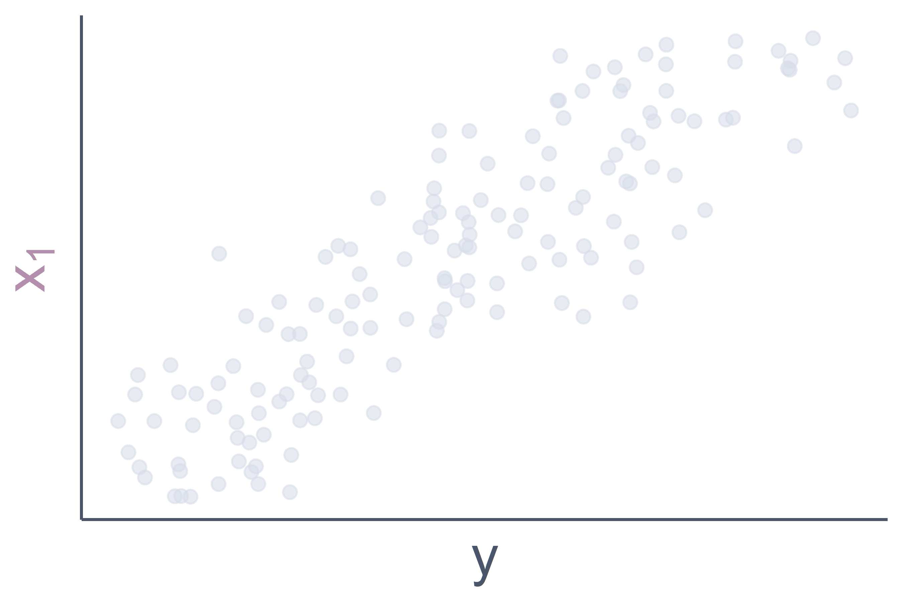

]

???

Implied assumption: linear association between incompl. covariate and outcome
(and other covariates)

--

.pull-right[
<br>
But what if 
$$\mathbb{E}(\mathbf y) = \theta_0 + 
\bbox[#3B4252, 2pt]{\theta_1 \color{var(--nord15)}{\mathbf x_1} +
\theta_2 \color{var(--nord15)}{\mathbf x_1}^2} +
\theta_3 \mathbf x_2 + \theta_4 \mathbf x_3$$


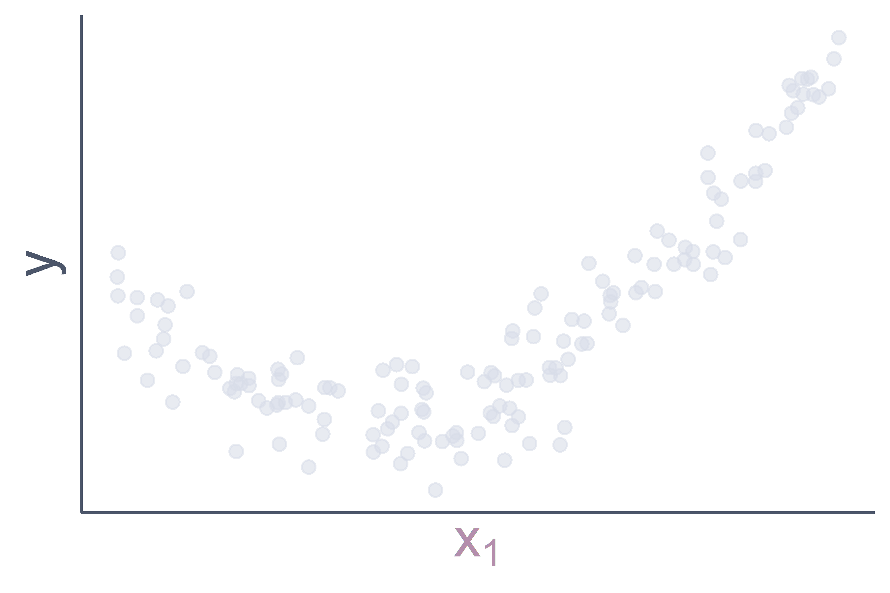

]

???

But what if we have a setting where we assume that there is a non-linear 
association, for example quadratic?

---

## Non-linear Associations

.pull-left[
* <span style="font-weight: bold; color:var(--nord4);">true association</span>: non-linear
* <span style="font-weight: bold; color:var(--nord7);">imputation assumption</span>: linear
]

.pull-right[
<span style="font-size: 56pt; position: relative; right: 110px; bottom: 20px;">} &#8680;</span>
<span style = "color: var(--nord11); font-size: 1.2rem; font-weight: bold; position: relative; bottom: 30px; right: 100px;">
bias!</span>
]


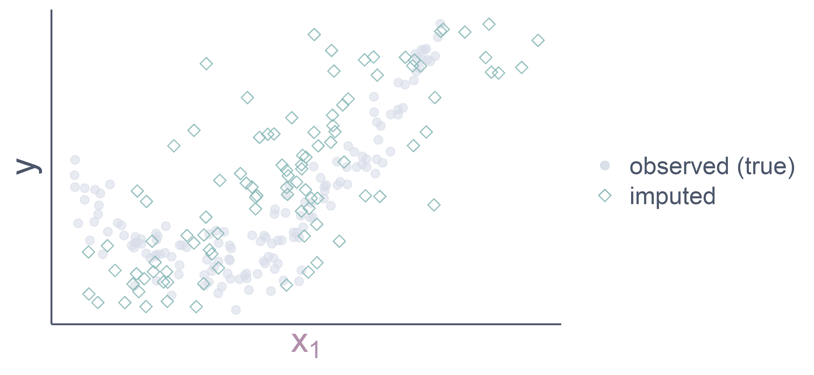

???

If we 

* correctly assume a non-linear association in the analysis model
* but a linear association in the imputation model

we introduce bias, even if we analyse the imputed data under the correct assumption

---

## Non-linear Associations

The **correct predictive distribution**
$$ p(\color{var(--nord15)}{\mathbf x_1} \mid \mathbf y, \mathbf x_2, \mathbf x_3, \boldsymbol\theta)$$
may not have a closed form.

<br>


.nord0box[
**<span style="font-size: 1.5rem;">&#8680;</span> 
We cannot easily specify the correct imputation model directly.**
]

???

* In many such settings the correct predictive distribution will not have a 
    closed form

=> we then cannot just specify the imputation model as a simple regression 
model with all other variables in the linear predictor.

---


## Time-to-Event Outcomes

<br>

**Proportional Hazards Model:**
$$h_i(t) = h_0(t) \exp(\color{var(--nord15)}{x_i} \beta_x + \mathbf z_i^\top \boldsymbol \beta_z)$$

.pull-left[
* $\color{var(--nord15)}{x_i}$: incomplete covariate
* $\mathbf z_i$: vector of other covariates
]
.pull-right[

<div style = "color: var(--nord3);">
<ul>
<li>\(h(t)\): hazard function</li>
<li>\(h_0(t)\): baseline hazard</li>
<li>\(\mathbf T\): observed event / censoring time</li>
<li>\(\mathbf D\): event indicator</li>
</ul>
</div>
]

???

Besides GLMs another commonly used type of model are proportional hazards
models to analyse time-to-event outcomes.

To simplify notation I assume that we have here

* one incomplete covariate $x$
* a vector of completely observed covariates $z$

For the rest we use the standard notation.

---

## Time-to-Event Outcomes

**Log-likelihood**
$$p(\mathbf T, \mathbf D \mid \color{var(--nord15)}{\mathbf x}, \mathbf z, \boldsymbol\beta) =
\mathbf D (\color{var(--nord15)}{\mathbf x} \beta_x + \mathbf z \boldsymbol\beta_z) - 
\int_0^T h_0(s)\exp(
\color{var(--nord15)}{\mathbf x} \beta_x + \mathbf z \boldsymbol\beta_z)ds$$

???
From the log likelihood of this model we can obtain the probability density 
for the survival outcome, i.e., the event time and indicator.

--

<br>

.nord0box[
<div style="font-size: 1.2rem; text-align: center; padding: 20px;">
<strong>Proportional hazards models imply<br>non-linear associations!</strong>
</div>
]

???

&#8680; clearly non-linear

---

## Multi-level Data

```{r echo = FALSE, warning = FALSE, message = FALSE}
p4 <- ggplot(JointAI::PBC, aes(x = day, y = log(bili), group = id,
                               alpha = factor(id))) +
  geom_line(size = 1, color = "#D8DEE9") +
  theme_classic() +
  theme(panel.background = element_rect(fill = "transparent", color = "transparent"),
        plot.background = element_rect(fill = "transparent", color = "transparent"),
        axis.text = element_blank(),
        axis.ticks = element_blank(),
        axis.line = element_line(color = "#4C566A"),
        axis.title = element_text(color = "#4C566A", size = 20),
        legend.background = element_blank(),
        legend.key = element_blank(),
        legend.text = element_text(colour = "#4C566A", size = 14),
        legend.position = "none") +
  xlab("time") +
  ylab("y") +
  scale_alpha_discrete(range = c(0.05, 0.3))

ggsave(plot = p4,
       file = "figures/trajectories_all.png", bg = "transparent",
       width = 5, height = 3, dpi = 600,
       type = "cairo", antialias = "none")

p4b <- p4 + 
  suppressWarnings(scale_alpha_discrete(range = c(0.01, 0.05))) +
  geom_line(data = subset(JointAI::PBC, id %in% c(1:5)),
            color = "#5E81AC",
            alpha = 0.7, size = 1) +
  geom_point(data = subset(JointAI::PBC, id %in% c(1:5)),
             color = "#5E81AC", alpha = 0.7, size = 1.5)

ggsave(plot = p4b,
       file = "figures/trajectories_allb.png", bg = "transparent",
       width = 5, height = 3, dpi = 600,
       type = "cairo", antialias = "none")


p5 <- p4 %+% subset(JointAI::PBC, id %in% c(1:5)) +
  geom_point(color = "#D8DEE9")

ggsave(plot = p5,
       file = "figures/trajectories5.png", bg = "transparent", width = 5, height = 3, dpi = 600,
       type = "cairo", antialias = "none")

```


.gr-left2[
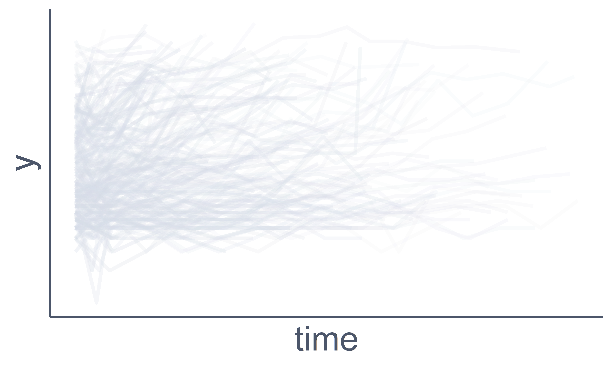
]


.gr-right2[

```{r, echo = FALSE}
html_longtab <- r"(<table class="simpletable">
<tr>
<th></th>
<th>\(\mathbf y\)</th>
<th>\(\mathbf x_1\)</th>
<th>\(\mathbf x_2\)</th>
<th>\(\mathbf x_3\)</th>
</tr>
<tr><td></td><td colspan = "4"; style = "padding: 0px;"><hr /></td><tr>
<td class="rownr"></td>
<td><i class = "fas fa-check"</i></td>
<td><i class = "fas fa-check"</i></td>
<td><i class = "fas fa-check"</i></td>
<td><i class = "fas fa-check"</i></td>
</tr>
<tr class="hlgt-row">
<td class="rownr">\(i\)</td>
<td><i class = "fas fa-check"</i></td>
<td style="color: var(--nord15);"><i class = "fas fa-question"></i></td>
<td><i class = "fas fa-check"</i></td>
<td><i class = "fas fa-check"</i></td>
</tr>
<tr class = "hlgt-row">
<td class="rownr">\(i\)</td>
<td><i class = "fas fa-check"</i></td>
<td style="color: var(--nord15);"><i class = "fas fa-question"></i></td>
<td><i class = "fas fa-check"</i></td>
<td><i class = "fas fa-check"</i></td>
</tr>
<tr class = "hlgt-row">
<td class="rownr">\(i\)</td>
<td><i class = "fas fa-check"</i></td>
<td style="color: var(--nord15);"><i class = "fas fa-question"></i></td>
<td><i class = "fas fa-check"</i></td>
<td><i class = "fas fa-check"</i></td>
</tr>
<tr>
<td class="rownr"></td>
<td><i class = "fas fa-check"</i></td>
<td><i class = "fas fa-check"</i></td>
<td><i class = "fas fa-check"</i></td>
<td><i class = "fas fa-check"</i></td>
</tr>
<tr>
<td class="rownr"></td>
<td><i class = "fas fa-check"</i></td>
<td><i class = "fas fa-check"</i></td>
<td><i class = "fas fa-check"</i></td>
<td><i class = "fas fa-check"</i></td>
</tr>
<tr>
<td class = "rownr"></td>
<td>\(\vdots\)</td>
<td>\(\vdots\)</td>
<td>\(\vdots\)</td>
<td>\(\vdots\)</td>
</tr>
</table>)"

```

```{r, echo = FALSE, results = "asis"}
cat(html_longtab)
```
]

???


Another setting in which specification of the predictive distribution for
a incomplete variable is not straightforward: **multi-level setting.**

For example:

* a response variable $y$: measured repeatedly over time in the same patient.

&#8680; data in long format<br>
(multiple rows with information on the same patient "i")

---
count: false

## Multi-level Data

.gr-left2[
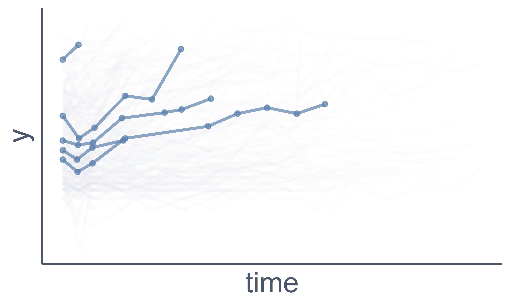
]

.gr-right2[

```{r, echo = FALSE, results = "asis"}
cat(html_longtab)
```
]

???

In this format:<br>
it does not matter if we have unbalanced data 
(different number of measurements, taken at different time points)

---

## Multi-level Data

.gr-left[
```{r, echo = FALSE, results = "asis"}
cat(html_longtab)
```
]

.gr-right[

**(Linear) Mixed Model**
$$\mathbb{E}(y_i(t)) = \underset{\text{fixed effects}}{\underbrace{\mathbf x_i(t)^\top\boldsymbol\beta}} + 
\underset{\text{random effects}}{\underbrace{\mathbf z_i(t)^\top\mathbf b_i}}$$

<br>

* **level-1** variables:<br>repeatedly measured / time-varying
* **level-2** variables:<br>baseline / patient specific / time-constant

]

???

For analysis: &#8680; typically use a mixed model

* takes into account that the repeated measurements for a patient are not independent
* can handle unbalanced data

Things get interesting when we have missing values in a baseline covariate:<br>
&$8680; when imputing we do not only need to take into account that multiple
missing values may belong to the same patient and should therefore be correlated,
**but that they should be identical.**

---

## Imputation in Multi-level Data

.gr-left2[
If $\color{var(--nord15)}{\mathbf x_1}$ is a **level-1** variable:

$$\mathbb{E}[\color{var(--nord15}{x_{i1}(t)}] = 
\underset{\color{var(--nord3)}{\text{fixed effects}}}{\color{var(--nord3)}{\underbrace{\color{var(--nord4)}{\theta_0 + \theta_1 y_i(t) + \theta_2 x_{2i}(t) + \theta_3 x_{3i}(t)}}}} + 
\underset{\color{var(--nord3)}{\substack{\text{random}\\\text{effects}}}}{\color{var(--nord3)}{\underbrace{\color{var(--nord4)}{\mathbf u_i \mathbf z_i(t)}}}}$$
]

.gr-right2[
```{r, echo = FALSE, results = "asis"}
cat(html_longtab)
```
]

???

If the incomplete variable $x_1$ was a level-1 variable (i.e. time-varying)
we could impute using a mixed model<br>
&#8680; imputed values for the same individual would be imputed as correlated

--


.raisebox150[

But if $\color{var(--nord15)}{\mathbf x_1}$ is a **level-2** variable?

* The above would result in different $\color{var(--nord15)}{\mathbf x_1}$ over
time.
* So would a standard GLM (applied to long-format data).

** <span style="font-size:1.5rem;">&#8680;</span> Imputation in wide format?**
]

???

If $x_1$ is a level-2 variable:

* imputed values for the same subject should be identical
* with the above model they would not be
* if we use a GLM instead they would also not be (not even correlated)

&#8680; For incomplete baseline variables imputation in wide format might be better(?)

---

```{r plotswide, include = FALSE, cache = TRUE}
d <- JointAI::PBC
v <- 365.25 * c(0, 0.5, 1:14)
d$tc <- cut(d$day, c(-Inf, (v + c(v[-1], NA))/2, Inf),
            labels = paste0("V", 1:(length(v))))

d$multi <- duplicated(subset(d, select = c("id", "tc"))) | 
  duplicated(subset(d, select = c("id", "tc")), fromLast = TRUE)
eg <- expand.grid(id = unique(d$id), tc = unique(d$tc))
eg$day_imp <- v[as.numeric(gsub("V", "", eg$tc))]
d2 <- merge(subset(d, select = setdiff(names(d), c("futime", "status"))),
            eg, all = TRUE)

d2 <- merge(d2, 
            unique(subset(d, select = c("id", "futime", "status"))),
            all = TRUE)


# d$day_combi <- d$day
# d$day_combi[is.na(d$day)] <- d$day_imp[is.na(d$day)]


p6_0 <- ggplot(subset(d2, id < 500), aes(x = day, y = id, group = id)) +
  geom_line(color = "#D8DEE9", alpha = 0.1) +
  theme_classic() +
  theme(panel.background = element_rect(fill = "transparent", color = "transparent"),
        plot.background = element_rect(fill = "transparent", color = "transparent"),
        axis.text = element_blank(),
        axis.ticks = element_blank(),
        axis.line = element_line(color = "#4C566A"),
        axis.title = element_text(color = "#4C566A", size = 20),
        legend.background = element_blank(),
        legend.key = element_blank(),
        legend.text = element_text(colour = "#4C566A", size = 14),
        legend.position = "none") +
  xlab("time") +
  ylab("id") +
  scale_x_continuous(breaks = seq(0, 5000, 200))

p6 <- p6_0 +
    geom_point(color = "#D8DEE9", alpha = 0.6)


ggsave(plot = p6,
       file = "figures/wideform0.png", bg = "transparent", width = 8, height = 4, dpi = 600,
       type = "cairo", antialias = "none")

p6a <- p6_0 + 
  geom_point(color = "#D8DEE9", alpha = 0.3) + 
  geom_vline(xintercept = (v + c(v[-1], NA))/2, lty = 2, color = "#5E81AC")

ggsave(plot = p6a,
       file = "figures/wideform1.png", bg = "transparent", width = 8, height = 4, dpi = 600,
       type = "cairo", antialias = "none")

# multiple observations per interval
p6b <- p6_0 + 
  geom_point(color = "#D8DEE9", alpha = 0.1) + 
  geom_vline(xintercept = (v + c(v[-1], NA))/2, lty = 2, color = "#5E81AC") +
  geom_point(data = subset(d2, multi), aes(color = "multi")) +
  scale_color_manual(name = "", 
                     values = "#D08770",
                     breaks = "multi",
                     label = "multiple\nobservations\nper interval") +
  theme(legend.position = "right")

ggsave(plot = p6b,
       file = "figures/wideform2.png", bg = "transparent", width = 9.5, height = 4, dpi = 600,
       type = "cairo", antialias = "none")


p6c <- p6_0 + 
  geom_point(color = "#D8DEE9", alpha = 0.1) + 
  geom_vline(xintercept = (v + c(v[-1], NA))/2, lty = 2, color = "#5E81AC") +
  geom_jitter(data = subset(d2, is.na(day)), height = 0,
             aes(x = day_imp, 
                 color = status != "dead" | day_imp <= futime), alpha = 0.6) +
  scale_color_manual(name = "", 
                     limits = c("TRUE", "FALSE", "obs"),
                     values = c("#EBCB8B", "#BF616A", "#D8DEE9"),
                     labels = c(paste0("\"unnecessary\"\nimputation\n(n = ",
                                       sum(is.na(d2$day) & d2$status != "dead"),
                                       ")"),
                                paste0("imputation\nafter death\n(n = ",
                                       sum(is.na(d2$day) & d2$status == "dead"),
                                       ")"),
                                paste0("observed\n(n = ", sum(!is.na(d2$day)), ")")
                                )) +
  theme(legend.position = "right",
        legend.key.height = unit(20, "mm"))

ggsave(plot = p6c,
       file = "figures/wideform3.png", bg = "transparent", width = 9.5, height = 4, dpi = 600,
       type = "cairo", antialias = "none")

```

## Imputation in Wide Format?


---
count: false
class: animated, fadeIn

## Imputation in Wide Format?
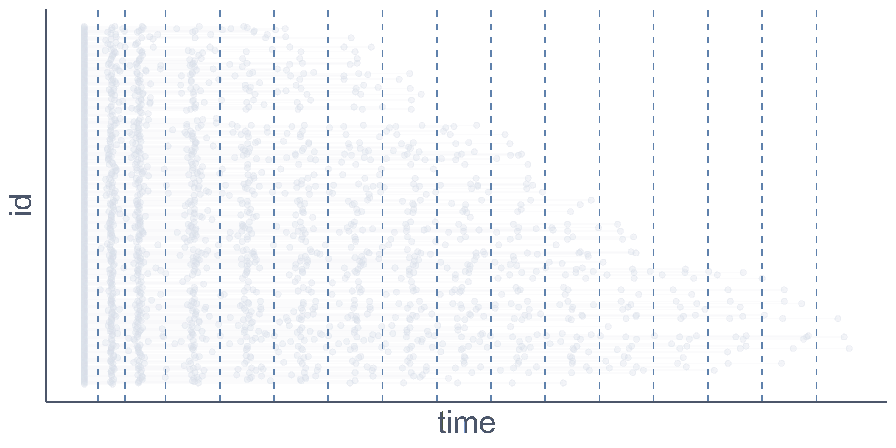

---
class: animated, fadeIn

## Imputation in Wide Format?
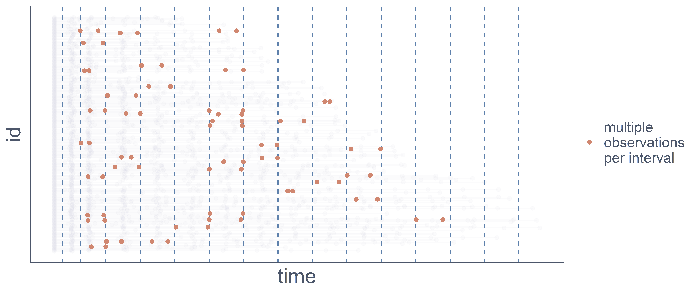

---
class: animated, fadeIn

## Imputation in Wide Format?
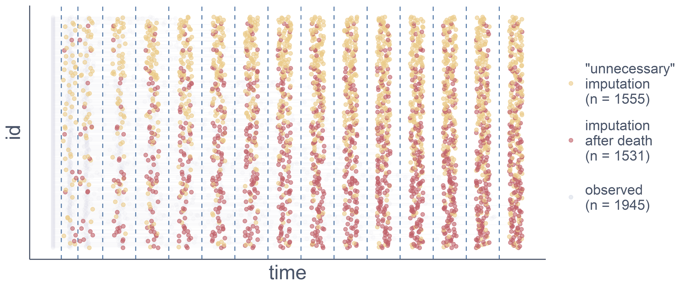

???

* In yellow: unnecessary imputations = imputations that we would not need
  for the analysis with a mixed model 
* in red: imputations after death

* we would impute all these values for the outcome and each time-varying covariate

---

## Imputation in Wide Format?

* may **not** be **feasible**
* if feasible:
    * may **require summarizing** the data
    * can be (very) **inefficient**

--
<br>

**Alternative:** .reference[[<i class = "fas fa-book"></i> Erler (2016)](https://doi.org/10.1002/sim.6944)]<br>
Summarize longitudinal trajectories using random effects.

<ul class="fa-ul">
  <li><span class="fa-li" style = "color:var(--nord14);">
      <i class="far fa-smile"></i></span>
      more efficient</li>
  <li><span class="fa-li" style = "color:var(--nord13);">
      <i class="far fa-meh"></i></span>
      requires sufficient fit</li>
  <li><span class="fa-li" style = "color:var(--nord11);">
  <i class="far fa-frown"></i></span>
  only for incomplete baseline covariates</li>
</ul>

---


## Imputation of Missing Covariates

Specifying the **correct imputation** model directly is **not straightforward** for

* GLMs with non-linear associations
* time-to-event outcomes
* multi-level settings

--

<br>

"Classic" (multiple) imputation specifies imputation models directly.

.nord0box[
**<span style="font-size: 1.5rem;">&#8680;</span>
We need another approach in these settings.**
]

---
class: center, middle, animated, fadeIn

# HOW?

---

## Getting the Correct Distribution

.gr-left2[
* We need $\;p(\color{var(--nord15)}{\mathbf x} \mid \mathbf y, \ldots)$
* We know $\;p(\mathbf y \mid \color{var(--nord15)}{\mathbf x}, \ldots)$
]

.gr-right2[

<div style = "color: var(--nord3);">
<ul>
<li>\(\mathbf x\): incomplete covariate</li>
<li>\(\mathbf y\): outcome</li>
<li>\(\ldots\): everything else </li>
</ul>
</div>
]

???

* We need to sample from the probability distribution of the incomplete variable
  $x$ given the outcome $y$ and everything else, including other variables and
  parameters.
  
* But we only know the distribution of the outcome $y$ given the incomplete and
  other covariates, because this is our analysis model.
  
* But Reverend Thomas Bayes comes to the rescue:

--

**Bayes Theorem:**

$$p(\color{var(--nord15)}{\mathbf x} \mid \mathbf y, \ldots) = 
\frac{p(\mathbf y \mid \color{var(--nord15)}{\mathbf x}, \ldots)\;
p(\color{var(--nord15)}{\mathbf x},\ldots)}{p\left(\mathbf y, \ldots\right)}$$

???

Bayes Theorem tells us how we can derive the conditional distribution that we
need from the one that we have.

---
count: false
class: animated, fadeIn

## Getting the Correct Distribution

.gr-left2[
* We need $\;p(\color{var(--nord15)}{\mathbf x} \mid \mathbf y, \ldots)$
* We know $\;p(\mathbf y \mid \color{var(--nord15)}{\mathbf x}, \ldots)$
]

.gr-right2[

<div style = "color: var(--nord3);">
<ul>
<li>\(\mathbf x\): incomplete covariate</li>
<li>\(\mathbf y\): outcome</li>
<li>\(\ldots\): everything else </li>
</ul>
</div>
]


**Bayes Theorem:**

$$p(\color{var(--nord15)}{\mathbf x} \mid \mathbf y, \ldots) = 
\frac{p(\mathbf y \mid \color{var(--nord15)}{\mathbf x}, \ldots)\;
p(\color{var(--nord15)}{\mathbf x},\ldots)}{p\left(\mathbf y, \ldots\right)}
\propto p(\mathbf y \mid \color{var(--nord15)}{\mathbf x}, \ldots)\;
\underset{\downarrow}{p(\color{var(--nord15)}{\mathbf x},\ldots)}$$
<div style="font-size: 0.8rem;width: 20%; position: relative; left: 750px; bottom: 15px;">
joint distribution of everything except the outcome
</div>


???

Denominator does not contain our incomplete variable $x$

&#8680; we can omit that part and save us some integration

&#8680; represent the cond. distribution of $x$ given $y$ as the product of 

* the distribution of the analysis model and
* the joint distribution of the incomplete variable $x$ and everything else.

---

## How to specify $p(\color{var(--nord15)}{\mathbf x}, \ldots)$?

For example:
$$p(\color{var(--nord15)}{\mathbf x_1}, \mathbf x_2, \mathbf x_3, \boldsymbol\theta)$$

???

&#8680; We need to figure out how to specify this joint distribution of the
covariates and parameters.

Usually:
* covariates of different types
* parameters include regression coefficients but also variance parameters.

&#8680; we can't specify this multivariate distribution directly because it does
not have a closed form.

--
<br>

**From probability theory:**&emsp; $\bbox[#2E3440, 5pt]{p(A, B) = p(A\mid B)\;p(B)}$

???

From probability theory we know that we can split the joint distribution of
two random variables.

--

In the example:
$$p(\color{var(--nord15)}{\mathbf x_1}, \mathbf x_2, \mathbf x_3, \boldsymbol\theta) = 
p(\color{var(--nord15)}{\mathbf x_1} \mid \mathbf x_2, \mathbf x_3, \boldsymbol\theta)\;
p(\mathbf x_2 \mid \mathbf x_3, \boldsymbol\theta)\;
p(\mathbf x_3 \mid \boldsymbol\theta)\; p(\boldsymbol\theta)$$

???

&#8680; apply this rule to our example<br>
&#8680; write the multivariate distribution as a sequence of univariate conditional distributions.

Bayesian &#8680; assume that parameters also are random variables &#8680;
distribution

Only univariate distributions &#8680; we can easily choose an appropriate model
type for each of covariate


---

## The Imputation Model

\begin{eqnarray*}
p(\color{var(--nord15)}{\mathbf x_1} \mid \mathbf y, \ldots) & = & 
p(\mathbf y\mid \color{var(--nord15)}{\mathbf x_1}, \mathbf x_2, \mathbf x_3,
\boldsymbol\theta) \;
p(\color{var(--nord15)}{\mathbf x_1}\mid \mathbf x_2, \mathbf x_3, \boldsymbol\theta)\;
p(\mathbf x_2 \mid \mathbf x_3, \boldsymbol\theta)\;
p(\mathbf x_3\mid\boldsymbol\theta)\; p(\boldsymbol\theta)
\end{eqnarray*}

???

Write out the full specification of the predictive distribution for
our incomplete covariate.

---
count: false

## The Imputation Model

\begin{eqnarray*}
p(\color{var(--nord15)}{\mathbf x_1} \mid \mathbf y, \ldots) & = & 
p(\mathbf y\mid \color{var(--nord15)}{\mathbf x_1}, \mathbf x_2, \mathbf x_3,
\boldsymbol\theta) \;
p(\color{var(--nord15)}{\mathbf x_1}\mid \mathbf x_2, \mathbf x_3, \boldsymbol\theta)\;
p(\mathbf x_2 \mid \mathbf x_3, \boldsymbol\theta)\;
p(\mathbf x_3\mid\boldsymbol\theta)\; p(\boldsymbol\theta)\\
& = & p(\mathbf y, \color{var(--nord15)}{\mathbf x_1}, \mathbf x_2, \mathbf x_3,
\boldsymbol\theta)
\end{eqnarray*}

???

&#8680; for this example the full conditional = joint distribution

--

.pull-left[
<br>
**In General:**

$$p(\color{var(--nord15)}{\mathbf x_1} \mid \mathbf y, \ldots) \propto
p(\mathbf y, \color{var(--nord15)}{\mathbf x_1}, \mathbf x_2, \mathbf x_3, \boldsymbol\theta)$$

]

???

In general: full-conditional is proportional to the joint distribution.

--

.pull-right[

]


???


&#8680; we can think about this approach in a slightly different way:
* start with the joint distribution of everything and 
* drive the full conditional distributions from the joint

Because we usually don't have a closed form for the joint distribution:<br>
specify the joint as the product of conditional distributions.

---
count: false

## The Imputation Model

\begin{eqnarray*}
p(\color{var(--nord15)}{\mathbf x_1} \mid \mathbf y, \ldots) & = & 
p(\mathbf y\mid \color{var(--nord15)}{\mathbf x_1}, \mathbf x_2, \mathbf x_3,
\boldsymbol\theta) \;
p(\color{var(--nord15)}{\mathbf x_1}\mid \mathbf x_2, \mathbf x_3, \boldsymbol\theta)\;
p(\mathbf x_2 \mid \mathbf x_3, \boldsymbol\theta)\;
p(\mathbf x_3\mid\boldsymbol\theta)\; p(\boldsymbol\theta)\\
& = & p(\mathbf y, \color{var(--nord15)}{\mathbf x_1}, \mathbf x_2, \mathbf x_3,
\boldsymbol\theta)
\end{eqnarray*}


.pull-left[
<br>
**In General:**

$$p(\color{var(--nord15)}{\mathbf x_1} \mid \mathbf y, \ldots) \propto
p(\mathbf y, \color{var(--nord15)}{\mathbf x_1}, \mathbf x_2, \mathbf x_3, \boldsymbol\theta)$$

<br>

* idea of the Gibbs sampler
* assures **congeniality**

]

.pull-right[

]

???

This is the idea of the Gibbs sampler.

Deriving the full conditionals from the joint distribution has a nice implication:

Because we start with the joint distribution we know that it exists.
&#8680; assures congeniality of the imputation models

<!-- --- -->

<!-- class: animated, fadeIn -->

<!-- ## Congeniality -->

<!-- .pull-left[ -->
<!--  -->
<!-- ] -->

<!-- .pull-right[ -->

<!-- <div style = "color: var(--nord12); font-weight: bold; position: relative; bottom: 20px;"> -->
<!-- In MICE / FCS: -->
<!-- </div> -->
<!-- 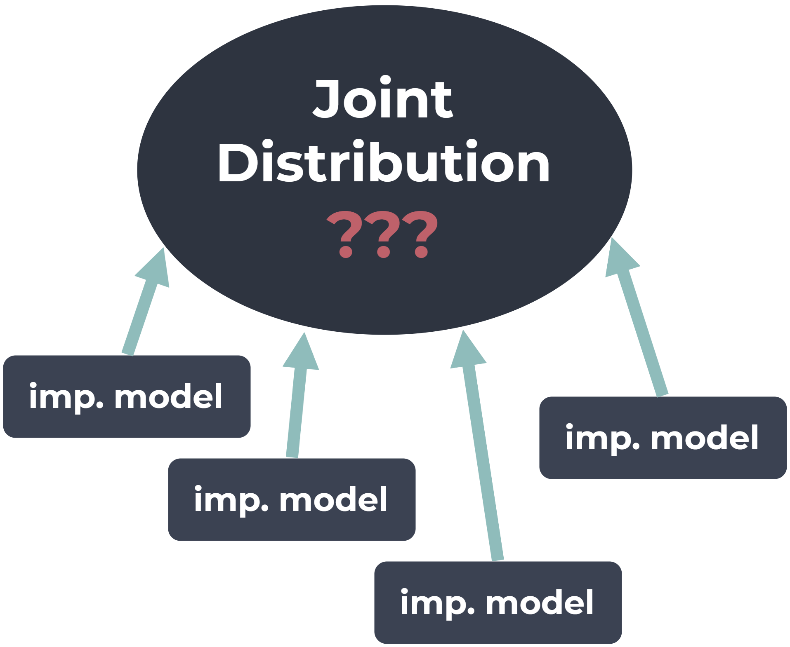 -->
<!-- ] -->


<!-- ??? -->

<!-- This is a theoretical issue with MICE / FCS MI:<br> -->
<!-- there: -->
<!-- * the full cond. distributions (= imputation models) are specified directly -->

<!-- &#8680; we don't know if a joint distribution exists that has the imputation  -->
<!-- models as its full conditionals. -->

<!-- &#8680; we may not be imputing from the correct distribution -->
---

## Sequence of Models

\begin{eqnarray*}
p(A, B) & = & p(A \mid B)\; p(B)
\end{eqnarray*}


???

Before: joint distribution of two random variables A and B can be expressed as
the conditional distribution of A given B and the distribution of B.

---
count: false

## Sequence of Models

\begin{eqnarray*}
p(A, B) &=& p(A \mid B)\; p(B)\\
p(A, B) &=& p(B \mid A)\; p(A)
\end{eqnarray*}

&#8680; any sequence possible, but some are more **convenient**

???

Of course it is also possible to do it the other way around.

When we represent the joint distribution using a sequence of conditional
distributions we can **choose the order of the sequence how ever we want.**

--

<br>

$$p(\mathbf y, \mathbf x, \boldsymbol\theta) = 
\bbox[#2E3440, 5pt]{\underset{\text{analysis model}}{\underbrace{p(\mathbf y \mid \mathbf x,
\color{var(--nord14)}{\boldsymbol\theta_{y\mid x}})}}}\;
p(\mathbf x \mid \boldsymbol\theta_x)\;
p(\color{var(--nord14}{\boldsymbol\theta_{y\mid x}}, \boldsymbol\theta_x)
\qquad \color{var(--nord3)}{\text{with } \boldsymbol\theta = (\boldsymbol\theta_{y\mid x}, \boldsymbol\theta_x)}$$

???

But specifying the sequence so that **one of the factors is the model for the
outcome** has some huge advantages.

--

* parameters of interest $\color{var(--nord14)}{\boldsymbol\theta_{y\mid x}}$
  estimated directly
???
1) parameters that we are interested in are estimated directly &#8680;
   imputation and the analysis jointly in the same estimation procedure.

--

* non-linear associations taken into account

???

2) non-linear associations specified in the analysis model are automatically
   taken into account (analysis model is a factor in the full conditional 
   distribution the imputed values are sampled from)
   
---

## Sequence of Models

Model for outcome $\color{var(--nord14)}{\mathbf y}$ "first" in the sequence:

$$p(\mathbf y, \mathbf x, \boldsymbol\theta) = 
\bbox[#2E3440, 5pt]{p(\color{var(--nord14)}{\mathbf y} \mid \mathbf x,
\boldsymbol\theta_{y\mid x})}\;
p(\mathbf x \mid \boldsymbol\theta_x)\;
p(\boldsymbol\theta_{y\mid x}, \boldsymbol\theta_x)
\qquad \color{var(--nord3)}{\text{with } \boldsymbol\theta = (\boldsymbol\theta_{y\mid x}, \boldsymbol\theta_x)}$$


&#8680; outcome $\color{var(--nord14)}{\mathbf y}$ not in any linear predictor<br>
&#8680; **no problem** to use **complex outcomes**

???
Additional advantage if we can specify the sequence so that the 
**analysis model is the first factor** in the sequence 
(outcome does not need to enter any of the linear predictors)

&#8680; allows us to specify the joint distribution (and consequently the full
conditional distributions of incomplete covariates) for settings with 
**complex outcomes**

--

<br>
**For covariates:** (in the multi-level setting)
$$p(\color{var(--nord15)}{\mathbf x_1}, \mathbf x_2(t), \mathbf x_3) \mid \boldsymbol\theta) = 
p(\mathbf x_2(t) \mid \color{var(--nord15)}{\mathbf x_1}, \mathbf x_3, \boldsymbol\theta)\;
p(\color{var(--nord15)}{\mathbf x_1} \mid \mathbf x_3, \boldsymbol\theta)\;
p(\mathbf x_3 \mid \boldsymbol\theta)$$


???
In multi-level settings:<br>
specify the sequence to our advantage: so that the models for variables on the
lowest level are specified first so that they have the variables of higher
levels in their linear predictor but not vice versa.

---

## Complex Models? Simple!

**(Multivariate) joint model for longitudinal and survival data:**

$$p(\mathbf T, \mathbf D, \mathbf y, \mathbf x, \mathbf b, \boldsymbol\theta) =
\underset{\text{analysis model}}{\underbrace{
\underset{\substack{\text{survival}\\\text{model}}}{\underbrace{
p(\mathbf T, \mathbf D \mid \mathbf b, \mathbf x, \boldsymbol \theta)}}\;\;
\underset{\substack{\text{(multivariate)}\\\text{longitudinal}\\\text{model}}}{\underbrace{
p(\mathbf y \mid \mathbf b, \mathbf x, \boldsymbol\theta)}}
}}\;\;
\underset{\substack{\text{covariate}\\\text{models}}}{\underbrace{
p(\mathbf x \mid \boldsymbol\theta)}}\;\;
\underset{\text{priors}}{\underbrace{p(\boldsymbol\theta)}}$$

???

This makes even the specification of rather complex models very simple.

--

<br>

<div class = "container">
<div class = "box">
<div class = "box-row">
<div class = "box-cell" style = "background: var(--nord0);">joint<br>distribution</div>&nbsp;
<div class = "box-cell">\(=\)</div> 
<div class = "box-cell" style = "background: var(--nord0);">analysis<br>model</div>&nbsp;
<div class = "box-cell" style = "background: var(--nord2);">covariate<br>models</div>&nbsp;
<div class = "box-cell" style = "background: var(--nord0)">priors</div>
</div>
</div>
</div>

???

It always comes down to 
* analysis model
* covariate models
* priors

And the covariate model part is the only addition to what we would specify in
the complete data setting.

If there are many covariates specification of the covariate models can be a 
bit tedious.

---

## Complex Models? Simple!

<div class = "container">
<div class = "box" style = "margin-left: 20px;">
<div class = "box-row">

<div class = "box-cell" style="width:180px;">
<strong>Specification</strong><br>of the joint<br> distribution:
</div>

<div class = "box-cell" style = "background: var(--nord0);">
<div style = "padding-bottom: 10px;"> <strong>User</strong></div>
<div class = "box-cell" style = "background: var(--nord1); border: 2px solid var(--nord8); ">analysis<br>model</div>
</div>

&nbsp;

<div class = "box-cell" style = "background: var(--nord0);">
<div style = "padding-bottom: 10px;"> <strong>JointAI</strong></div>
<div class = "box-row">
<div class = "box-cell" style = "background: var(--nord1);">covariate<br>models</div>&nbsp;
<div class = "box-cell" style = "background: var(--nord1)">priors</div>
</div></div>

</div></div></div>

???

But here JointAI can help.

...

--

<br>

<div class = "container">
<div class = "box" style = "margin-left: 20px;">
<div class = "box-row">

<div class = "box-cell" style="width:180px;">
<strong>Estimation:</strong>
</div>

<div class = "box-cell" style = "background: var(--nord0);">
<div style = "padding-bottom: 10px;"> <strong>JointAI</strong></div>
<div class = "box-cell" style = "background: var(--nord1);">pre-processing</div>
</div>

&nbsp;

<div class = "box-cell" style = "background: var(--nord0);">
<div style = "padding-bottom: 10px;"> <strong>rjags / JAGS</strong></div>
<div class = "box-cell" style = "background: var(--nord1);">MCMC sampling</div>
</div>

&nbsp;

<div class = "box-cell" style = "background: var(--nord0);">
<div style = "padding-bottom: 10px;"> <strong>JointAI</strong></div>
<div class = "box-cell" style = "background: var(--nord1);">post-processing</div>
</div>

</div></div></div>

???

Because the sequential specification of the joint distribution typically has
no closed form sampling the imputed values and parameters is not straightforward.

But software (in this case JAGS) does this step for us.

---
class: center, middle, animated, fadeIn

# JointAI

---

## Model Types

.row[
.three-cols[
**Univariate Models:**

* `lm_imp()`
* `glm_imp()`
* `clm_imp()`
* `mlogit_imp()`
* `betareg_imp()`
* `lognorm_imp()`
]

.three-cols[
**Mixed Models**

* `lme_imp()`
* `glme_imp()`
* `clmm_imp()`
* `mlogitmm_imp()`
* `betamm_imp()`
* `lognormmm_imp()`
]

.three-cols[
**Survival Models**

* `coxph_imp()`
* `survreg_imp()`
* `JM_imp()`
]
]


.footnote[
[Full documentation at https://nerler.github.io/JointAI/](https://nerler.github.io/JointAI/)
]

---

## Specification

Specification **like standard complete data functions**:

```{r, message = FALSE, cache = TRUE}
library("JointAI")
lm1 <- lm_imp(SBP ~ gender + age + alc * creat, data = NHANES, n.iter = 200)
```


--

<br>

First thing after fitting a model: **check convergence!**

```{r, eval = FALSE}
traceplot(lm1)
```

```{r trace-lm1, include = FALSE}
traceplot(lm1, nrow = 2, use_ggplot = TRUE) +
  scale_color_manual(values = c(nord7, nord15, nord10))

```


---

## Traceplot

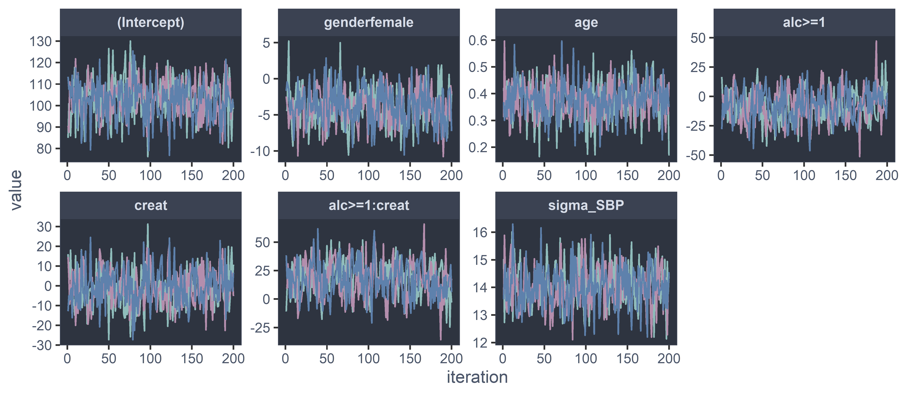

---

## Model Summary

.scroll450[
```{r}
summary(lm1, missinfo = TRUE)
```
]


---

## Which Models were Fitted?

.scroll450[
```{r}
list_models(lm1)
```
]

---

## The JAGS Model

.scroll450[
```{r}
lm1$jagsmodel
```
]


---

## Covariate Model Types
```{r}
lm1$models
```

--

<br>

**Change the model types:**
```{r, cache = TRUE}
lm2 <- lm_imp(SBP ~ gender + age + alc + creat, data = NHANES, n.iter = 200,
              models = c(creat = "lognorm"))
lm2$models
```

---

## Covariate Model Types

.pull-left[
**Univariate:**

* `glm_<family>_<link>`
    * <span style = "background-color: var(--nord0);">`glm_gaussian_identity`</span><br>
      (alias: `lm`)
    * <span style = "background-color: var(--nord0);">`glm_binomial_logit`</span><br>
      (alias: `glm_logit`)
    * `glm_poisson_log`
    * ...
* `lognorm`
* `beta`
* <span style = "background-color: var(--nord0);">`clm`</span>
* <span style = "background-color: var(--nord0);">`mlogit`</span>
]

.pull-right[
**Mixed models:**

* `glmm_<family>_<link>`
    * <span style = "background-color: var(--nord0);">`glmm_gaussian_identity`</span><br>
      (alias: `lmm`)
    * <span style = "background-color: var(--nord0);">`glmm_binomial_logit`</span><br>
      (alias: `glmm_logit`)
    * `glmm_gamma_inverse`
    * ...
* `glmm_lognorm`
* `glmm_beta`
* <span style = "background-color: var(--nord0);">`clmm`</span>
* <span style = "background-color: var(--nord0);">`mlogitmm`</span>
]


---

## More Features

.three-cols[
<button class="modal-button" href="#myModal1">Model Specification</button>
<div id="myModal1" class="modal">
  <div class="modal-content">
    <span class="close">&times;</span>
    <ul>
    <li>auxiliary variables (<a href = "https://nerler.github.io/JointAI/articles/ModelSpecification.html#auxiliary-variables"><code>auxvars</code></a>)</li>
    <li> shrinkage (ridge)
    (<a href = "https://nerler.github.io/JointAI/articles/ModelSpecification.html#shrinkage"><code>shrinkage</code></a>)
    <li> truncation of continuous distributions 
    (<a href = "https://nerler.github.io/JointAI/articles/ModelSpecification.html#functions-with-restricted-support"><code>trunc</code></a>)
    <li> setting reference categories 
    (<a href="https://nerler.github.io/JointAI/articles/ModelSpecification.html#reference-categories"><code>refcats</code></a>)
    <li> change hyper-parameters 
    (<a href = "https://nerler.github.io/JointAI/articles/ModelSpecification.html#hyper-parameters"><code>hyperpars</code></a>)
    <li> parameters to be monitored 
    (<a href="https://nerler.github.io/JointAI/articles/SelectingParameters.html"><code>monitor_params</code></a>)</li>
    <li> export the JAGS model
    (<code>modelname</code>,
    <code>modeldir</code>,
    <code>keep_model</code>)
    <li> customize the JAGS model (<code>modelname</code>,
    <code>modeldir</code>,
    <code>overwrite</code>)
    </ul>
  </div>
</div>


<button class="modal-button" href="#myModal2">MCMC settings</button>
<div id="myModal2" class="modal">
  <div class="modal-content">
    <span class="close">&times;</span>
    <ul>
    <li>adaptive phase 
    (<a href="https://nerler.github.io/JointAI/articles/MCMCsettings.html#adaptive-phase"><code>n.adapt</code></a>)</li>
    <li>sampling phase 
        (<a href="https://nerler.github.io/JointAI/articles/MCMCsettings.html#sampling-iterations"><code>n.iter</code></a>)</li>
    <li>number of chains
        (<a href="https://nerler.github.io/JointAI/articles/MCMCsettings.html#number-of-chains"><code>n.chains</code></a>)</li>
    <li>thinning
        (<a href="https://nerler.github.io/JointAI/articles/MCMCsettings.html#thinning"><code>thin</code></a>)</li>
    <li>initial values 
        (<a href="https://nerler.github.io/JointAI/articles/MCMCsettings.html#initial-values"><code>inits</code></a>,
    <code>&lt;object&gt;$mcmc_settings$inits</code>)</li>
    <li>seed value (<code>seed</code>)</li>
    <li>continue sampling 
    (<a href="https://nerler.github.io/JointAI/reference/add_samples.html"><code>add_samples()</code></a>)</li>
    </ul>
  </div>
</div>


<button class="modal-button" href = "#modal-plots">Plots</button>
<div class="modal" id="modal-plots">
  <div class="modal-content">
    <span class="close">&times;</span>
    <ul>
    <li>data distribution 
        (<a href="https://nerler.github.io/JointAI/articles/VisualizingIncompleteData.html#visualize-the-distribution-of-each-variable">
        <code>plot_all()</code></a>)</li>
    <li>missing data pattern 
        (<a href = "https://nerler.github.io/JointAI/articles/VisualizingIncompleteData.html#missing-data-pattern">
        <code>md_pattern()</code></a>)</li>
    <li>MCMC chains 
        (<a href = "https://nerler.github.io/JointAI/articles/AfterFitting.html#trace-plot">
        <code>traceplot()</code></a>)</li>
    <li>posterior density 
        (<a href="https://nerler.github.io/JointAI/articles/AfterFitting.html#density-plot"><code>densplot()</code></a>)</li>
    <li>imputed vs observed data 
        (<a href="https://nerler.github.io/JointAI/articles/AfterFitting.html#export-of-imputed-values">
        <code>plot_imp_distr()</code></a>)</li>
    <li>Monte Carlo Error 
    (<a href="https://nerler.github.io/JointAI/articles/AfterFitting.html#sec:mcerror"><code>plot(MC_error(&lt;object&gt;))</code></a>)</li>
    </ul>
  </div>
</div>

<button class="modal-button" href = "#modal-parallel">Parallel Sampling</button>
<div class="modal" id="modal-parallel">
  <div class="modal-content">
    <span class="close">&times;</span>
    Using the R packages <strong>future</strong> and <strong>doFuture</strong>:
<pre><code class="r hljs remark-code">
<div class="remark-code-line"><span class="hljs-keyword">library</span>(<span class="hljs-string">"doFuture"</span>)</div>
<div class="remark-code-line">plan(multiprocess(workers = <span class="hljs-number">6</span>))</div>
<div class="remark-code-line">registerDoFuture()</div>
<div class="remark-code-line"></div>
<div class="remark-code-line"><span class="hljs-comment">## fit JointAI model ...</span></div><br>
<div class="remark-code-line"><span class="hljs-comment">## to re-set to sequential evaluation:</span></div>
<div class="remark-code-line">plan(sequential())</div>
</code></pre>
</div>
</div>

]

.three-cols[

<button class="modal-button" href = "#modal-clm">
Cumulative Logit Models</button>
<div class="modal" id="modal-clm">
  <div class="modal-content">
    <span class="close">&times;</span>
    <ul>
    <li>invert the OR 
    (<a href="https://nerler.github.io/JointAI/reference/model_imp.html#cumulative-logit-mixed-models"><code>rev</code></a>)
        \[\log\left(\frac{P(y_i \color{var(--nord14)}{>} k)}{P(y_i \color{var(--nord14)}{\leq} k)}\right) = \gamma_k + \eta_i
        \quad\text{vs}\quad
        \log\left(\frac{P(y_i \color{var(--nord14)}{\leq} k)}{P(y_i \color{var(--nord14)}{>} k)}\right) = \gamma_k + \eta_i\]
    </li>
    <li>partial proportional odds 
        (<a href="https://nerler.github.io/JointAI/reference/model_imp.html#cumulative-logit-mixed-models"><code>nonprop</code></a>)
        \[\log\left(\frac{P(y_i > k)}{P(y_i \leq k)}\right) = \gamma_k + \eta_i
        \quad\text{vs}\quad
        \log\left(\frac{P(y_i \leq k)}{P(y_i > k)}\right) = \gamma_k + \eta_i \color{var(--nord14)}{+ \eta_{ki}}\]
    </li>
    </ul>
  </div>
</div>


<button class="modal-button" href = "#modal-multi-level">
Multi-level Models</button>
<div class="modal" id="modal-multi-level">
  <div class="modal-content">
    <span class="close">&times;</span>
    <ul>
    <li><strong>lme4</strong> or <strong>nlme</strong> type specification</li>
    <li>nested and crossed random effects<br>(determined by data structure)</li>
    <li>2, 3, 4, ... levels of grouping,
        i.e., <code> ... + (time | id) + (1 | group) + (1 | center ) + (1 | country) + ...</code></li>
    <li>multi-level structure also for survival models</li><br>
    <li>uses hierarchical centering, i.e., 
    \(\mathbf b \sim N(\mathbf X\boldsymbol\beta, \mathbf D)\)</li>
    </ul>
    <a href="https://nerler.github.io/JointAI/reference/model_imp.html#model-formulas">&#8680; For more info see the package documentation.</a>
  </div>
</div>


<button class="modal-button" href = "#modal-survival">
Survival<br>(with Time-varying Covariates) </button>
<div class="modal" id="modal-survival">
  <div class="modal-content">
    <span class="close">&times;</span>
    <ul>
    <li>proportional hazards model with <strong>time-varying covariates</strong><br>
    (using <a href="https://nerler.github.io/JointAI/reference/model_imp.html#survival-models-with-frailties-or-time-varying-covariates">
    <code> + (1 | id)</code></a> and
    <a href="https://nerler.github.io/JointAI/reference/model_imp.html#survival-models-with-frailties-or-time-varying-covariates">
    <code> timevar = "&lt;...&gt;"</code></a>)</li>
    <li><strong>baseline hazard</strong>: B-spline with <code>df_basehaz</code> degrees of freedom</li><br>
    <li></strong>joint model</strong> for longitudinal and survival data<br>
    (using <a href = "https://nerler.github.io/JointAI/reference/model_imp.html#modelling-multiple-models-simultaneously-joint-models">
    <code>formula = list(&lt;...&gt;)</code></a> and
    <a href="https://nerler.github.io/JointAI/reference/model_imp.html#modelling-multiple-models-simultaneously-joint-models">
    <code>timevar = "&lt;...&gt;"</code></a>)</li>
    <li><strong>association structure</strong> (<code>assoc_type</code>)
        <ul>
        <li>underlying value (<code>underl.value</code>)</li>
        <li>observed/imputed value (<code>obs.value</code>)</li>
        </ul>
    </li>
    <li><strong>multivariate joint model</strong>:<br>
    on CRAN <span style = "color:var(--nord12);">block-diagonal random effects</span><br>
        GitHub (rd_vcov) <span style = "color:var(--nord12);">full / block-diagonal / independent random effects</span></li>
    </ul>
  </div>
</div>

]

.three-cols[

<button class="modal-button" href = "#modal-blackbox">
Shining Light into the Black Box</button>
<div class="modal" id="modal-blackbox">
  <div class="modal-content">
    <span class="close">&times;</span>
    <ul>
    <li>monitor any node 
        (<a href="https://nerler.github.io/JointAI/articles/SelectingParameters.html#other-parameters">
        <code>monitor_params</code></a>)</li>
    <li>see the JAGS model (<code>&lt;object&gt;$jagsmodel</code>)</li>
    <li>print model info (<a href="https://nerler.github.io/JointAI/articles/SelectingParameters.html#side-note-getting-information-about-of-the-imputation-models">
    <code>list_models()</code></a>,
    <code>&lt;object&gt;$models</code>)</li>
    <li>access the JAGS model object
    (<code>&lt;object&gt;$model</code>)</li>
    <li>list all monitored parameters 
    (<a href="https://nerler.github.io/JointAI/articles/SelectingParameters.html#parameters-of-the-analysis-model">
    <code>parameters()</code></a>)</li>
    <li>list all regression coefficients 
    (<code>&lt;object&gt;$coef_list</code>)</li>
    </ul>
  </div>
</div>

<button class="modal-button" href = "#modal-compinfo">
Computational Infos</button>
<div class="modal" id="modal-compinfo">
  <div class="modal-content">
    <span class="close">&times;</span>
    <code>&lt;object&gt;$comp_info</code>:
    <ul>
    <li>start time</li>
    <li>duration</li>
    <li>package version</li>
    <li>parallel setting</li>
    </ul>
  </div>
</div>

<button class="modal-button" href = "#modal-subset">
Output Options</button>
<div class="modal" id="modal-subset">
  <div class="modal-content">
    <span class="close">&times;</span>
    <ul>
    <li>Subset selection
        <ul>
        <li>iterations 
            (<a href="https://nerler.github.io/JointAI/articles/AfterFitting.html#subset-of-mcmc-samples">
            <code>start</code>, <code>end</code>, <code>thin</code></a>)</li>
        <li>nodes
        (<a href="https://nerler.github.io/JointAI/articles/AfterFitting.html#subset-of-parameters">
        <code>subset</code></a>)</li>
        <li>chains (<code>exclude_chains</code>)</li>
        <li>sub-models (<code>outcome</code>)</li>
        </ul><br>
    <li>export imputed values<br>(<code>monitor_params = c(imps = TRUE)</code>,
<code>get_MIdat()</code>)</li>
    </ul>
  </div>
</div>


<button class="modal-button" href = "#modal-prediction">Prediction</button>
<div class="modal" id="modal-prediction">
  <div class="modal-content">
    <span class="close">&times;</span>
    <ul>
    <li>create "newdata" for effect plots 
        (<a href="https://nerler.github.io/JointAI/reference/predDF.html">
        <code>predDF()</code></a>)</li><br>
    <li>prediction (<code>predict()</code>)
    <ul> 
    <li><strong>GLM(M)</strong> type models: linear predictor or outcome scale<br>
    <span style = "text-decoration: underline;">for now</span>:
    <span style = "color: var(--nord12);">
    assumption random effects = 0</span>
    </li>
    <li><strong>prop. hazard models</strong>: (log) hazard, (-log) survival</li>
    <li><strong>joint model</strong> for longitudinal & survival data:
    <span style = "color:var(--nord11);">not 
    <span style = "text-decoration: underline;">yet</span> possible</span></li>
    </ul></li>
    </ul>
  </div>
</div>

]


---
class: center, middle, animated, fadeIn

# Applications

---

## Risk Factors in Chronic Hepatitis C

```{r, echo = FALSE}
fun <- function(x) x * (x + 1)/2

make_d <- function(range, var, val) {
  m <- expand.grid(x = range,
                   y = range,
                   val = val
  )

  m$alpha <- runif(nrow(m), 0.8, 1)
  
  for (i in 1:nrow(m)) {
    if (m$y[i] > m$x[i]) {
      m$alpha[i] <- m$alpha[m$x == m$y[i] & m$y == m$x[i]]
    }
  }
  
  m
}

a <- 0.5
m <- rbind(
  make_d(1:4, var = a, val = 1),
  make_d(5:6, var = a, val = 2),
  make_d(7:12, var = a, val = 3),
  make_d(13:16, var = a, val = 4)
)

p <- ggplot(m, aes(x = x, y = y, fill = factor(val), alpha = alpha)) +
  geom_tile(colour = "grey20") +
  scale_alpha_continuous(range = c(0.8, 1), guide = FALSE) +
  theme_void() +
  scale_y_reverse() +
  scale_fill_manual(breaks = c(1, 2, 3, 4),
                    values = c(nord14, nord10, nord8, nord15),
                    guide = FALSE) +
  theme(rect = element_rect(fill = "transparent", colour = "transparent")) +
  coord_cartesian(xlim = c(1, 16), ylim = c(16, 1))

ggsave(plot = p, 
       file = "figures/VC.png", width = 5, height = 5, bg = "transparent")

```


* N = 713 (19709 rows)
* 4 biomarkers
* 8 baseline covariates
    * 5 incomplete (0 - 19% NA)
    * 66% complete cases

--

* Association between biomarkers<br>via fixed effects
* Independent random effects<br>variance-covariance matrices

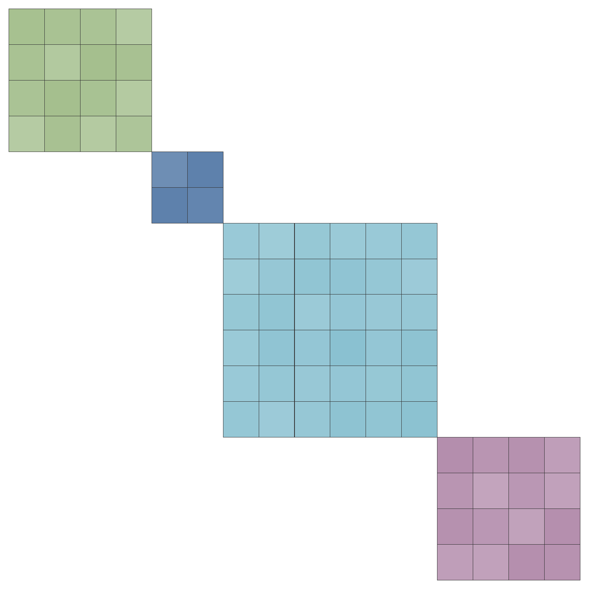

--

* Initial values for $\boldsymbol\tau$, $\mathbf b$ and $\mathbf D^{-1}$<br>
  from multivariate mixed model.

---

## Risk Factors in Chronic Hepatitis C

```{r, eval = FALSE}
fmla <- list(Surv(etime, event) ~ age + sex + year +
               alcohol + smoking + BMI + antiHBc + DM +
               `logBili + logALT + logAST + Plt`,
             
             Plt ~ age + sex + `logAST + logALT + logBili` +
               ns(time, df = 3) + (ns(time, df = 3) | StudyID),
             
             logBili ~ age + sex + `logAST + logALT` +
               time + (time | StudyID),
             
             logAST ~ age + sex + `logALT` + ns(time, df = 5) +
               (ns(time, df = 5) | StudyID),
             
             logALT ~ age0 + sex + ns(time, df = 3) + (ns(time, df = 3) | StudyID)
)

mod <- JM_imp(fmla, data = HCVdat, timevar = "time", `inits = <inits>`,
              n.iter = 10000, n.chains = 8)
```


---

## Recurrence of CD after ICR

.gr-left[
* 3 time-to-event outcomes
* 15 covariates (shared)
    * 5 incomplete<br>(0% - 27% NA)
    * 60% complete cases
    
<br>
**&#8680; fit multiple models jointly**

* imputation only once
* use info from all outcomes
* avoid copy-pasting

]

.gr-right[

```{r, eval = FALSE}
fmla_clin <- Surv(etime_clin, event_clin) ~ 
  S_length + age + sex + year + smoking + ...

fmla_endo <- Surv(etime_endo1, event_endo) ~ 
  S_length + age + sex + year + smoking + ...

fmla_surg <- Surv(etime_surg, event_surg) ~ 
  S_length + age + sex + ... 
```

]

???

Recurrence of Crohn's disease after ileocecal resection

---

## Recurrence of CD after ICR


```{r, eval = FALSE}
CD_model <- coxph_imp(`formula = list(fmla_clin, fmla_endo, fmla_surg)`,
                      data = CD_data, models = c(S_length = 'lognorm'),
                      n.iter = 600, n.chains = 8, seed = 2020)
```


* N = 823
* 8 chains (in parallel)
* 600 iterations each
* computational time: 1.25 hours

---

## Patient Survival in PSC Patients

```{r patsurv, echo = FALSE}
PSCdat <- data.frame(time = c(0, 2, 5, 8, 15),
                     recurrence = 0,
                     graftnr = 1)

PSCdat$recurrence[PSCdat$time >= 5] <- 1
PSCdat$graftnr[PSCdat$time >= 2] <- 2
PSCdat$graftnr[PSCdat$time >= 8] <- 3

p_rec1 <- ggplot(PSCdat, aes(x = time, y = recurrence)) +
  geom_point(color = nord4) +
  geom_step(color = nord4) +
  scale_x_continuous(name = "follow-up time",
                     breaks = PSCdat$time,
                     labels = c("baseline\nLTx", "LTx", "recurrence", "LTx", "death")) +
  scale_y_continuous(name = "recurrence of PSC",
                     breaks = unique(PSCdat$recurrence),
                     labels = c(dQuote("healthy"), "recurence")) +
  theme(axis.text = element_text(color = nord4))

p_graftnr1 <- ggplot(PSCdat, aes(x = time, y = graftnr)) +
  geom_point(color = nord4) +
  geom_step(color = nord4) +
  scale_x_continuous(name = "follow-up time",
                     breaks = PSCdat$time,
                     labels = c("baseline\nLTx", "LTx", "recurrence", "LTx", "death")) +
  scale_y_continuous(name = "graft number",
                     breaks = unique(PSCdat$graftnr),
                     labels = paste0("graft ", unique(PSCdat$graftnr))) +
  theme(axis.text = element_text(color = nord4),
        axis.title.x = element_blank())

cowplot::plot_grid(p_rec1, p_graftnr1, nrow = 2, align = "v")
```

---

## Patient Survival in PSC Patients

.gr-left[
* data in long format
* N = 1549 (3679 rows)
* 8 covariates
    * 3 incomplete<br>(4% - 11% NA)
    * 88% complete cases
    
** &#8680; time-dependent PH model**

]

--

.gr-right[
* random effect to "group" rows of the same patient
* `timevar`: match covariate time to event time
```{r, eval = FALSE}
fmla_patsurv <- Surv(pat_time, pat_event) ~ 
  recip_sex + graft_type + ... +
  graftnr * recurrence + `(1 | ID_pat)`

patsurv <- coxph_imp(fmla_patsurv,
                     data = PSC_data,
                     `timevar = 'futime'`,
                     n.iter = 1000,
                     n.chains = 6)
```

]


---
count: false

## Patient Survival in PSC Patients

.gr-left[

* N = 1549 (3679 rows)
* data in long format
* 8 covariates
    * 3 incomplete<br>(4% - 11% NA)
    * 88% complete cases
    
** &#8680; time-dependent PH model**

* 6 chains (in parallel)
* 1000 iterations each
* computational time:<br>47 minutes

]

.gr-right[

* random effect to "group" rows of the same patient
* `timevar`: match covariate time to event time


```{r, eval = FALSE}
fmla_patsurv <- Surv(pat_time, pat_event) ~ 
  recip_sex + graft_type + ... +
  graftnr * recurrence + `(1 | ID_pat)`

patsurv <- coxph_imp(fmla_patsurv,
                     data = PSC_data,
                     `timevar = 'futime'`,
                     n.iter = 1000,
                     n.chains = 6)
```
]


---

## Graft Survival in PSC Patients
```{r graftsurv, echo = FALSE}
PSCdat2 <- data.frame(time = c(0, 2, 2, 5, 8, 8, 15),
                      graftnr = paste0("graft ", c(1, 1, 2, 2, 2, 3, 3)), 
                      recurrence = c(0, 0, 0, 1, 1, 1, 1))

p_rec2 <- ggplot(PSCdat2, aes(x = time, y = recurrence, color = factor(graftnr))) +
  geom_point() +
  geom_step() +
  facet_wrap("graftnr", scales = "free_x") +
  scale_x_continuous(name = "graft lifetime",
                     breaks = unique(PSCdat2$time),
                     labels = c("LTx", "LTx", "recurrence", "LTx", "death")) +
  scale_y_continuous(name = "recurrence of PSC",
                     breaks = unique(PSCdat2$recurrence),
                     labels = c(dQuote("healthy"), "recurence")) +
  scale_color_manual(values = c(nord7, nord15, nord10)) +
  theme(axis.text = element_text(color = nord4))


p_graftnr2 <- ggplot(PSCdat2, aes(x = time, y = graftnr, 
                                  color = factor(graftnr))) +
  geom_point() +
  geom_step() +
  facet_wrap("graftnr", scales = "free_x") +
  scale_x_continuous(name = "graft lifetime",
                     breaks = unique(PSCdat2$time),
                     labels = c("LTx", "LTx", "recurrence", "LTx", "death")) +
  scale_y_discrete(name = "graft number") +
  scale_color_manual(values = c(nord7, nord15, nord10)) +
  theme(axis.text = element_text(color = nord4),
        axis.title.x = element_blank())

cowplot::plot_grid(p_rec2, p_graftnr2, nrow = 2, align = "v")
```


---

## Graft Survival in PSC Patients

* random effect to group **rows of same graft**
* random effect to group **grafts of same patient**

```{r, eval = FALSE}
fmla_graftsurv <- Surv(graft_time, graft_event) ~ recip_sex + graft_type + 
  ... + graftnr * recurrence + `(1 | ID_graft) + (1 | ID_pat)`

graftsurv_Bayes <- coxph_imp(fmla_graftsurv,  data = PSC_data,
                             `timevar = 'futime'`,
                             n.iter = 1000, n.chains = 6)
```

--

**&#8680; can be seen as gap time approach for recurrent events**


---
class: center, middle, animated, fadeIn

# <span style="color:var(--nord1);font-size: 2.25rem;">(almost)</span><br>The End


---

## To Keep in Mind

Every model / method makes **assumptions**:

* The **models need to fit** the data.
  * analysis model(s)
  * covariate models
--

* **ignorable missingness**
    * extensions to non-ignorable missingness possible
--
* **auxiliary variables**
    * use them
    * be aware of implied (independence) assumptions
    
--

.nord0box[

<div style = "text-align: center; padding: 20px;">
<strong>Feedback? Ideas? Want to collaborate? Let me know!</strong>
</div>

]


---
class: the-end, center, middle
layout: true
count: false

## Thank you for your attention!


<div id="contact">
<i class="fas fa-envelope"></i> n.erler@erasmusmc.nl &emsp;
<a href="https://twitter.com/N_Erler"><i class="fab fa-twitter"></i> N_Erler</a> &emsp;
<a href="https://github.com/NErler"><i class="fab fa-github"></i> NErler</a> &emsp;
<a href="https://nerler.com"><i class="fas fa-globe-americas"></i> https://nerler.com</a>
</div>

---
count: false


```{r metathis, echo=FALSE}
library("metathis")

meta() %>%
  meta_name("github-repo" = "NErler/JointAI") %>% 
  meta_social(
    title = "Joint Analysis and Imputation of Incomplete Data in R",
    description = paste(
      "A fully Bayesian approch for handling missing values in complex settings."
    ),
    url = "https://nerler.com/slides/inria2020/",
    image = "https://nerler.com/slides/inria2020/graphics/share-card.png",
    image_alt = paste(
      "Title slide of Joint Analysis and Imputation of Incomplete Data in R",
      "by Nicole Erler"
    ),
    og_type = "website",
    og_author = "Nicole Erler",
    twitter_card_type = "summary_large_image",
    twitter_creator = "@N_Erler",
    twitter_site = "@N_Erler"
  )
```


<!-- <script src='https://cdn.mathjax.org/mathjax/latest/MathJax.js?config=TeX-AMS-MML_HTMLorMML'></script> -->
<script type="text/javascript" async
  src="https://cdnjs.cloudflare.com/ajax/libs/mathjax/2.7.7/MathJax.js?config=TeX-MML-AM_CHTML">
</script>
 
 
<script>
// Get the button that opens the modal
var btn = document.querySelectorAll("button.modal-button");

// All page modals
var modals = document.querySelectorAll('.modal');

// Get the <span> element that closes the modal
var spans = document.getElementsByClassName("close");

// When the user clicks the button, open the modal
for (var i = 0; i < btn.length; i++) {
 btn[i].onclick = function(e) {
    e.preventDefault();
    modal = document.querySelector(e.target.getAttribute("href"));
    modal.style.display = "block";
 }
}

// When the user clicks on <span> (x), close the modal
for (var i = 0; i < spans.length; i++) {
 spans[i].onclick = function() {
    for (var index in modals) {
      if (typeof modals[index].style !== 'undefined') modals[index].style.display = "none";    
    }
 }
}

// When the user clicks anywhere outside of the modal, close it
window.onclick = function(event) {
    if (event.target.classList.contains('modal')) {
     for (var index in modals) {
      if (typeof modals[index].style !== 'undefined') modals[index].style.display = "none";    
     }
    }
}
</script>

