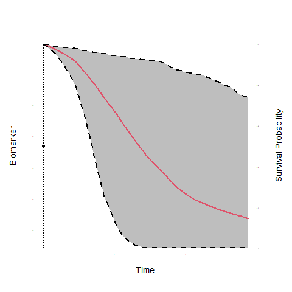

class: title-slide-custom
count: false

```{r setup, include=FALSE}
library("JMbayes2")
library("knitr")
library("animation")
library("ggplot2")

nord0 = "#2E3440"
nord1 = "#3B4252"
nord2 = "#434C5E"
nord3 = "#4C566A"

## Snow Storm colors
nord4 = "#D8DEE9"
nord5 = "#E5E9F0"
nord6 = "#ECEFF4"

## Frost colors
nord7 = "#8FBCBB"
nord8 = "#88C0D0"
nord9 = "#81A1C1"
nord10 = "#5E81AC"

## Aurora colors
nord11 = "#BF616A"
nord12 = "#D08770"
nord13 = "#EBCB8B"
nord14 = "#A3BE8C"
nord15 = "#B48EAD"

knitr::opts_chunk$set(dev = "png", dpi = 600, 
                      dev.args = list(bg = "transparent", type = "cairo",
                                      antialias = "none"),
                      out.width = "100%", fig.width = 8, fig.height = 3.5)

xaringanExtra::use_tile_view()
xaringanExtra::use_fit_screen()
load("plotJM_data.RData")
```

<!-- <h1>JMbayes2</h1> -->
<div style="font-size: 50pt; font-weight: 900; color: var(--nord4); margin-top: 60px;">
JMbayes2
</div>

<div style="font-size: 26pt; color: var(--nord9); font-weight: 300; margin-top:40px;">
Extended Joint Models under the Bayesian Approach
</div>

<div id = "author">
<div style = "font-size: 32pt; font-weight: bolder; color: var(--nord4);">Dimitris Rizopoulos</div>
<div style = "color: var(--nord9);">Department of Biostatistics</div>
</div>

<div id="contact">
<a href="mailto:d.rizopoulos@erasmusmc.nl"><i class="fas fa-envelope"></i> d.rizopoulos@erasmusmc.nl</a> &emsp;
<a href="https://twitter.com/drizopoulos"><i class="fab fa-twitter"></i> drizopoulos</a> &emsp;
<a href="https://github.com/drizopoulos"><i class="fab fa-github"></i> drizopoulos</a> &emsp;
</div>

---
layout: true

<link href="https://unpkg.com/nord-highlightjs@0.1.0/dist/nord.css" rel="stylesheet" type="text/css" />
<link href="fontawesome-free-5.14.0-web/css/all.css" rel="stylesheet">

<div class="my-footer"><span>
<a href="https://twitter.com/drizopoulos"><i class="fab fa-twitter"></i> drizopoulos</a>
&emsp;&emsp;&emsp;&emsp;
<a href="https://github.com/drizopoulos"><i class="fab fa-github"></i> drizopoulos</a> &emsp;&emsp;&emsp;&emsp;
<a href = "http://www.drizopoulos.com/"><i class="fas fa-globe-americas"></i> www.drizopoulos.com</a>
</span></div> 

---
class: center, middle, animated, fadeIn

# Joint Models:<br>Current Standard

---

## A Bit of History

<p> </p>

--

<div style = "width: 75%; padding: 1.15em 2em; background-color: var(--nord0); margin: auto; display: block;">
<strong>Joint models have been around for many years...</strong>
</div>

--

<br>

- Two parallel trajectories

.pull-left[
**Event Process**
<div style = "width: 75%; padding: 1.15em 2em; background-color: var(--nord0); margin: auto; display: block;">
endogenous time-varying covariates
</div>
]

.pull-right[
**Longitudinal Outcomes**
<div style = "width: 75%; padding: 1.15em 2em; background-color: var(--nord0); margin: auto; display: block;">
non-random (MNAR) dropout
</div>
]


---

## JMs and Extensions

<div style = "width: 75%; padding: 1.15em 2em; background-color: var(--nord0); margin: auto; display: block;">
<strong>Basic assumption: <font color = "red">Conditional Independence</font></strong> <br> The random effects \(\color{var(--nord15)}{b}\) explain all interrelationships.
</div>

.footnote[
[<i class = "fas fa-book"></i> Rizopoulos (2012)](https://www.crcpress.com/product/isbn/9781439872864)
]

--

<br>
* $\mathcal{Y}$: Longitudinal process
* $\mathcal{T}$: Event process

--

\begin{align*}
p\{\mathcal{Y},\, \mathcal{T} \mid \color{var(--nord15)}{b}\} = 
p\{\mathcal{Y} \mid \color{var(--nord15)}{b}\} \; 
p\{\mathcal{T} \mid \color{var(--nord15)}{b}\}
\end{align*}

---

## JMs and Extensions

```{r, echo = FALSE, results = 'hide', message=FALSE}
saveGIF({
    for(i in 1:10) {
        op <- par(mgp = c(2, 0.0, 0), tcl = 0)
        JM::plot.survfitJM(survPrbs[[i]], estimator = "mean", conf.int = TRUE,
                           include.y = TRUE, lwd = 2, ylab = "Survival Probability", 
                           ylab2 = "Biomarker", xlab = "Time", 
                           main = "",
                           cex.axis = 0.001, cex.axis.z = 0.001, cex.lab = 1.2, cex.lab.z = 1.2,
                           col = c(2, 1, 1), fill.area = TRUE, pch = 16, lty = c(1, 2, 2))
        par(op)
    }
}, movie.name = "./JM.gif")
```

 

---

## JMs and Extensions

<br>

.pull-left[
**Longitudinal Process**
- multiple outcomes
- continuous, discrete, left-censored
- flexible models (splines, etc.)
]

.pull-right[
**Event Process**
- competing risks
- multi-state processes
- recurrent events
- multivariate
]

---

## JMs and Extensions

**Conditional Independence:** .reference[[<i class = "fas fa-book"></i> Rizopoulos (2012)](https://www.crcpress.com/product/isbn/9781439872864)]

<ul class="fa-ul">
  <li><span class="fa-li" style = "color:var(--nord14);">
      <i class="far fa-smile"></i></span>
      mathematically convenient</li>
  <li><span class="fa-li" style = "color:var(--nord11);">
  <i class="far fa-frown"></i></span>
  computionally intensive</li>
</ul>

--

.pull-left[
**Maximum Likelihood:**
<div style = "width: 75%; padding: 1.15em 2em; background-color: var(--nord0); margin: auto; display: block;">
requires high-dimensional numerical integration
</div>
]

.pull-right[
**Bayesian:**
<div style = "width: 75%; padding: 1.15em 2em; background-color: var(--nord0); margin: auto; display: block;">
requires sampling high-dimensional random effects
</div>
]

---

## Theory vs Practice

As with many other statistical techniques,<br> 
&nbsp;&nbsp;&nbsp;it took some years for JMs software to appear

--

<br>

<div style = "width: 75%; padding: 1.15em 2em; background-color: var(--nord0); margin: auto; display: block;">
<strong>Nowadays, given the rise of the  <font color = "red">R ecosystem</font> a number of packages is available</strong>
</div>


---

## Available Software

.pull-left[
**Maximum Likelihood:**

<button class="modal-button" href="#JM"><strong>JM</strong></button>
<div id="JM" class="modal">
  <div class="modal-content">
  <span class="close">&times;</span>
  <ul>
    <li> One continuous longitudinal outcome</li>
    <li> Competing risks</li>
    <li> (pseudo) adaptive Gaussian quadrature</li>
  </ul>
  </div>
</div>

<button class="modal-button" href="#joineRML"><strong>joineRML</strong></button>
<div id="joineRML" class="modal">
  <div class="modal-content">
  <span class="close">&times;</span>
  <ul>
    <li> Multiple continuous longitudinal outcomes</li>
    <li> Monte Carlo EM (<font color="red">needs tuning</font>)</li>
  </ul>
  </div>
</div>

<button class="modal-button" href="#frailtyPack"><strong>frailtyPack</strong></button>
<div id="frailtyPack" class="modal">
  <div class="modal-content">
  <span class="close">&times;</span>
  <ul>
    <li> One continuous longitudinal outcome</li>
    <li> recurrent events & terminating event</li>
  </ul>
  </div>
</div>
]

.pull-right[
**Bayesian:**
<button class="modal-button" href="#JMbayes"><strong>JMbayes</strong></button>
<div id="JMbayes" class="modal">
  <div class="modal-content">
  <span class="close">&times;</span>
  <ul>
    <li> Multiple longitudinal outcomes of different type</li>
    <li> competing risks & multi-state models</li>
    <li> Corrected two-stage approach (<font color="red">not fully Bayesian</font>)</li>
  </ul>
  </div>
</div>

<button class="modal-button" href="#INLAjoint"><strong>INLAjoint</strong></button>
<div id="INLAjoint" class="modal">
  <div class="modal-content">
  <span class="close">&times;</span>
  <ul>
    <li> Multiple longitudinal outcomes of different type</li>
    <li> competing risks & multi-state models</li>
    <li> <font color="red">approximate</font></li>
    <li> <font color="red">limited convergence diagnostics</font></li>
  </ul>
  </div>
</div>

<button class="modal-button" href="#stan_jm"><strong>stan_jm</strong></button>
<div id="stan_jm" class="modal">
  <div class="modal-content">
  <span class="close">&times;</span>
  <ul>
    <li> Multiple longitudinal outcomes of different type</li>
    <li> fully Bayesian in STAN (<font color="red">slow</font>)</li>
  </ul>
  </div>
</div>

<button class="modal-button" href="#bamlss"><strong>jm_bamlss</strong></button>
<div id="bamlss" class="modal">
  <div class="modal-content">
  <span class="close">&times;</span>
  <ul>
    <li> single longitudinal outcomes</li>
    <li> no competing risks nor multi-state models</li>
  </ul>
  </div>
</div>
]

---

## Available Software

<br><br>

<div style = "width: 75%; padding: 1.15em 2em; background-color: var(--nord0); margin: auto; display: block;">
<strong>Still no software package exists to satisfy all needs</strong>
</div>

---
class: center, middle, animated, fadeIn

# JMbayes2

---

## A New Package

.nord0box[
**<span style="font-size: 1.5rem;">&#8680;</span> 
Learning from the lessons of the past we decided to create a new package**
]

--

<br>

Our aims

.pull-left[
* versatile
* user-friendly
* fast
* complete
]

.pull-right[
<div style = "color: var(--nord3);">
<ul>
<li>cover (almost) all extensions</li>
<li>straightforward syntax</li>
<li><strong>C++</strong> & computational tricks</li>
<li>support functions</li>
</ul>
</div>
]

---

## Under the Hood

.nord0box[
**Work horse: Metropolis-Hastings algorithm** <br>
&nbsp;&nbsp;<span style="font-size: 1.5rem;">&#8680;</span> adaptive optimal scaling using the Robbins–Monro process
]

--

<br>

.nord0box[
**Computational aspects** <br>
&nbsp;&nbsp;<span style="font-size: 1.5rem;">&#8680;</span> parallel sampling of random effects<br>
&nbsp;&nbsp;<span style="font-size: 1.5rem;">&#8680;</span> info from separate fits<br>
]

---

## Under the Hood

<br>

.nord0box[
**Implementation** <br>
&nbsp;&nbsp;<span style="font-size: 1.5rem;">&#8680;</span> MCMC written in C++<br>
&nbsp;&nbsp;<span style="font-size: 1.5rem;">&#8680;</span> avoiding double computations<br>
]


---

## An Example

```{r, message = FALSE, cache = TRUE}
library("JMbayes2")
fm1 <- lme(log(serBilir) ~ year * sex, data = pbc2, random = ~ year | id)
CoxFit <- coxph(Surv(years, status2) ~ sex, data = pbc2.id)

jointFit1 <- jm(CoxFit, fm1, time_var = "year")
```

--

<br>

**Check convergence**

```{r, eval = FALSE}
ggtraceplot(jointFit1, "alphas")
```


---

## Traceplot

```{r, include = TRUE, echo = FALSE}
ggtraceplot(jointFit1, "alphas")
```

---

## Model Summary

.scroll450[
```{r}
summary(jointFit1)
```
]

---

## Multivariate

<br>

```{r, message = FALSE, cache = TRUE}
fm2 <- lme(prothrombin ~ year * sex, data = pbc2, random = ~ year | id)
fm3 <- mixed_model(ascites ~ year + sex, data = pbc2,
                   random = ~ year | id, family = binomial())

jointFit2 <- jm(CoxFit, list(fm1, fm2, fm3), time_var = "year",
                n_iter = 12000L, n_burnin = 2000L, n_thin = 5L)
```

---

## Multivariate

.scroll450[
```{r}
summary(jointFit2)
```
]

---

## Functional Forms

```{r, message = FALSE, cache = TRUE}
jointFit3 <- update(jointFit2, 
  functional_forms = ~ slope(log(serBilir)) + slope(log(serBilir)):sex + 
    area(prothrombin))
```

--

.pull-left[
**Slope**
$$h_i(t) = h_0(t) \exp\biggl\{\alpha \bbox[#2E3440, 5pt]{\frac{d\color{var(--nord14)}{\eta_i(t)}}{dt}}\biggr\}$$
]

.pull-right[
**(normalized) Area**
$$h_i(t) = h_0(t) \exp\biggl\{\alpha \bbox[#2E3440, 5pt]{\frac{1}{t} \int_0^t \color{var(--nord14)}{\eta_i(s)}\; ds}\biggr\}$$
]

<div align="center" style="padding-top:30px;">\(\color{var(--nord3)}{\eta_i(t) = \mathbf x_i(t)^\top \boldsymbol \beta + \mathbf z_i(t)^\top \mathbf b_i}\)</div>

---

## Functional Forms

.scroll450[
```{r}
summary(jointFit3)
```
]

---

## Competing Risks

Bring the data in the competing risks long format

```{r}
pbc2.idCR <- crisk_setup(pbc2.id, statusVar = "status", censLevel = "alive", 
                    nameStrata = "CR")

pbc2.idCR[pbc2.idCR$id %in% c(1, 2, 5), c("id", "years", "status", "status2", "CR")]
```

---

## Competing Risks

<br>

Fit a competing risks Cox model

```{r}
CoxFit_CR <- coxph(Surv(years, status2) ~ (age + drug) * strata(CR),
                     data = pbc2.idCR)
```

---

## Competing Risks

<br>

Fit the competing risks joint model

```{r, message = FALSE, cache = TRUE}
jFit_CR <- jm(CoxFit_CR, fm1, time_var = "year", 
              functional_forms = ~ value(log(serBilir)):CR, 
              n_iter = 25000L, n_burnin = 5000L, n_thin = 5L)
```

---

## Competing Risks

.scroll450[
```{r}
summary(jFit_CR)
```
]

---

## More Features

.three-cols[

<button class="modal-button" href="#GLMMs"><strong>Mixed Effects Models</strong></button>
<div id="GLMMs" class="modal">
  <div class="modal-content">
  <span class="close">&times;</span>
  <ul>
  <li>Gaussian (<code>lme(...)</code>)</li>
    <li>Student's-t (<code>mixed_model(..., <span class="hljs-string">family = students.t(df = 4)</span>)</code>)</li>
    <li>Beta (<code>mixed_model(..., <span class="hljs-string">family = beta.fam()</span>)</code>)</li>
    <li>Gamma (<code>mixed_model(..., <span class="hljs-string">family = Gamma()</span>)</code>)</li>
    <li>censored Gaussian (<code>mixed_model(..., <span class="hljs-string">family = censored.normal()</span>)</code>)</li>
  </ul>
  <br>
  <ul>
    <li>Binomial (<code>mixed_model(..., <span class="hljs-string">family = binomial()</span>)</code>)</li>
    <li>Poisson (<code>mixed_model(..., <span class="hljs-string">family = poisson()</span>)</code>)</li>
    <li>Negative Binomial (<code>mixed_model(..., <span class="hljs-string">family = negative.binomial()</span>)</code>)</li>
    <li>Beta Binomial (<code>mixed_model(..., <span class="hljs-string">family = beta.binomial()</span>)</code>)</li>
  </ul>
  
  <a href="https://drizopoulos.github.io/JMbayes2/articles/Non_Gaussian_Mixed_Models.html"><i class="fas fa-globe-americas"></i> vignette distributions</a>
  </div>
</div>

<button class="modal-button" href="#Plots"><strong>Diagnostics</strong></button>
<div id="Plots" class="modal">
  <div class="modal-content">
  <span class="close">&times;</span>
  <ul>
    <li>MCMC chains (<code>traceplot()</code> or <code>ggtraceplot()</code>)</li>
    <li>Density (<code>traceplot()</code> or <code>ggtraceplot()</code>)</li>
    <li>Gelman-Rubin (<code>gelman_diag()</code>)</li>
    <li>cumulative plot (<code>cumuplot()</code>)</li>
  </ul>
  </div>
</div>

]

.three-cols[

<button class="modal-button" href="#Penalties"><strong>Shrinkage Priors</strong></button>
<div id="Penalties" class="modal">
  <div class="modal-content">
  <span class="close">&times;</span>
      Using the <strong>priors</strong> argument we can specify penalties:
  <pre><code class="r hljs remark-code">
  <div class="remark-code-line">jm(..., <span class="hljs-number">priors = list("penalty_alphas" = "horseshoe")</span>)</div>
  <div class="remark-code-line"></div>
  <div class="remark-code-line">jm(..., <span class="hljs-number">priors = list("penalty_gammas" = "ridge")</span>)</div>
</code></pre>
  </div>
</div>

<button class="modal-button" href="#Compare"><strong>Model Comparison</strong></button>
<div id="Compare" class="modal">
  <div class="modal-content">
  <span class="close">&times;</span>
      Using the <code>compare_jm()</code> function we can compare fitted joint models using DIC, WAIC and LPML
  <pre><code class="r hljs remark-code">
  <div class="remark-code-line"><span class="hljs-number">fit1</span> <- jm(<span class="hljs-number">CoxModel1</span>, <span class="hljs-number">MixedModels1</span>, ...)</div>
  <div class="remark-code-line"><span class="hljs-string">fit2</span> <- jm(<span class="hljs-string">CoxModel2</span>, <span class="hljs-string">MixedModels2</span>, ...)</div>
  <div class="remark-code-line"></div>
  <div class="remark-code-line">compare_jm(<span class="hljs-number">fit1</span>, <span class="hljs-string">fit2</span>)</div>
</code></pre>
  </div>
</div>

]

.three-cols[
<button class="modal-button" href="#DynPred"><strong>Dynamic Predictions</strong></button>
<div id="DynPred" class="modal">
  <div class="modal-content">
  <span class="close">&times;</span>
  Using the <code>predict()</code> method we can calculate (dynamic) predictions
  <ul>
    <li>Longitudinal outcomes</li>
    <li>Event outcomes (including competing risks)</li>
    <li>Accuracy measures</li>
      <ul>
        <li>discrimination: <code>tvROC()</code>, <code>tvAUC()</code></li>
        <li>calibration: <code>calibration_plot()</code>, <code>calibration_metrics()</code></li>
        <li>overall: <code>tvBrier()</code></li>
      </ul>
  </ul>
  
  <a href="https://drizopoulos.github.io/JMbayes2/articles/Dynamic_Predictions.html"><i class="fas fa-globe-americas"></i> vignette predictions</a>
  </div>
</div>


<button class="modal-button" href="#MCEvents"><strong>Multi-State Processes</strong></button>
<div id="MCEvents" class="modal">
  <div class="modal-content">
  <span class="close">&times;</span>
  <strong>Using <code>mc_setup()</code> to setup the data and fitting a stratified Cox model</strong>
  <ul>
    <li>Multiple longitudinal outcomes</li>
    <li>Relative risk model per transition</li>
  </ul>
  
  <a href="https://drizopoulos.github.io/JMbayes2/articles/Multi_State_Processes.html"><i class="fas fa-globe-americas"></i> vignette multi-state</a>
  </div>
</div>


<button class="modal-button" href="#RecEvents"><strong>Recurrent Events</strong></button>
<div id="RecEvents" class="modal">
  <div class="modal-content">
  <span class="close">&times;</span>
  Using <code>rc_setup()</code> to setup the data, fitting a stratified Cox model 
  and calling <code>jm(..., <span class="hljs-string">recurrent = "..."</span>)</code>
  <ul>
    <li>Multiple longitudinal outcomes</li>
    <li>Relative risk model with a frailty term for recurrent events</li>
    <li>Relative risk models competing risks terminating events linked with frailty</li>
    <li>Gap time and Calendar time formulations</li>
  </ul>
  
  <a href="https://drizopoulos.github.io/JMbayes2/articles/Recurring_Events.html"><i class="fas fa-globe-americas"></i> vignette recurrent</a>
  </div>
</div>

]

---
class: center, middle

.nord0box[
More about **JMbayes2** in the dedicated website<br><br>
<a href="https://drizopoulos.github.io/JMbayes2/"><i class="fas fa-globe-americas"></i> https://drizopoulos.github.io/JMbayes2/</a>
]

---
class: the-end, center, middle
layout: true
count: false

## Thank you for your attention!


<div id="contact">
<a href="mailto:d.rizopoulos@erasmusmc.nl"><i class="fas fa-envelope"></i> d.rizopoulos@erasmusmc.nl</a> &emsp;
<a href="https://twitter.com/drizopoulos"><i class="fab fa-twitter"></i> drizopoulos</a> &emsp;
<a href="https://github.com/drizopoulos"><i class="fab fa-github"></i> drizopoulos</a> &emsp;
<a href="http://www.drizopoulos.com/"><i class="fas fa-globe-americas"></i> http://www.drizopoulos.com/</a>
</div>

---
count: false

<!-- <script src='https://cdn.mathjax.org/mathjax/latest/MathJax.js?config=TeX-AMS-MML_HTMLorMML'></script> -->
<script type="text/javascript" async
  src="https://cdnjs.cloudflare.com/ajax/libs/mathjax/2.7.7/MathJax.js?config=TeX-MML-AM_CHTML">
</script>
 
 
<script>
// Get the button that opens the modal
var btn = document.querySelectorAll("button.modal-button");

// All page modals
var modals = document.querySelectorAll('.modal');

// Get the <span> element that closes the modal
var spans = document.getElementsByClassName("close");

// When the user clicks the button, open the modal
for (var i = 0; i < btn.length; i++) {
 btn[i].onclick = function(e) {
    e.preventDefault();
    modal = document.querySelector(e.target.getAttribute("href"));
    modal.style.display = "block";
 }
}

// When the user clicks on <span> (x), close the modal
for (var i = 0; i < spans.length; i++) {
 spans[i].onclick = function() {
    for (var index in modals) {
      if (typeof modals[index].style !== 'undefined') modals[index].style.display = "none";    
    }
 }
}

// When the user clicks anywhere outside of the modal, close it
window.onclick = function(event) {
    if (event.target.classList.contains('modal')) {
     for (var index in modals) {
      if (typeof modals[index].style !== 'undefined') modals[index].style.display = "none";    
     }
    }
}
</script>

